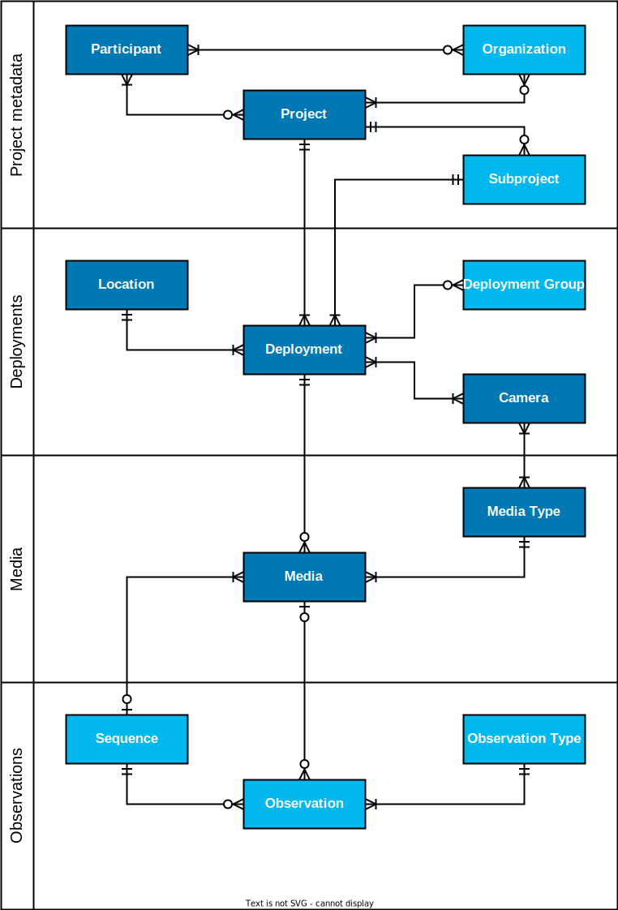
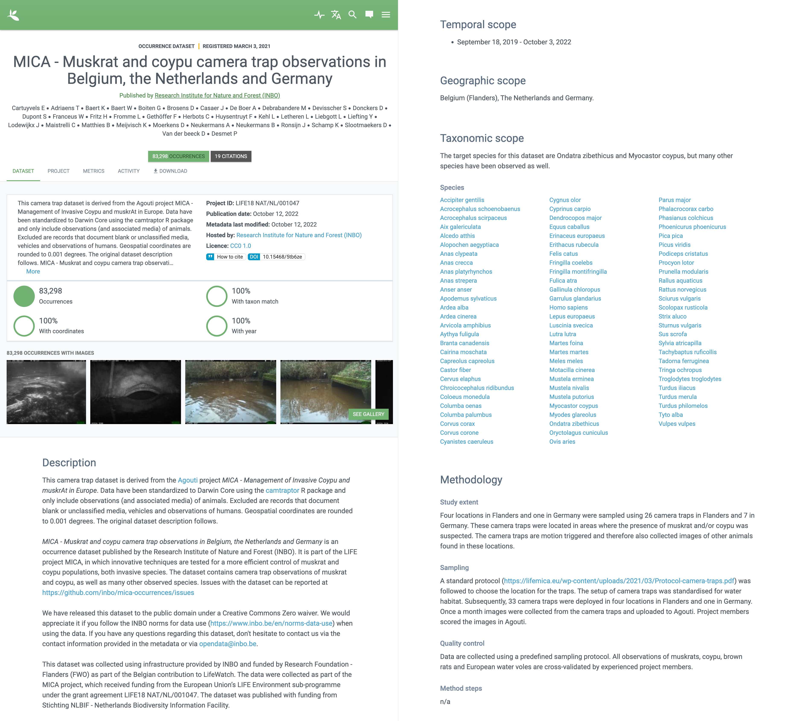
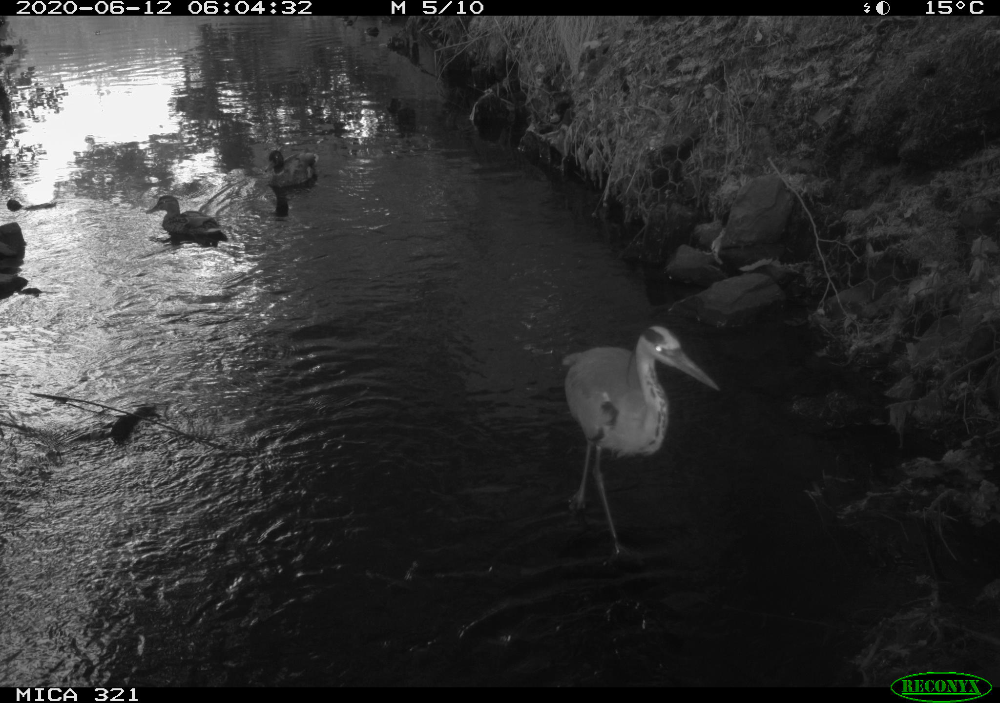
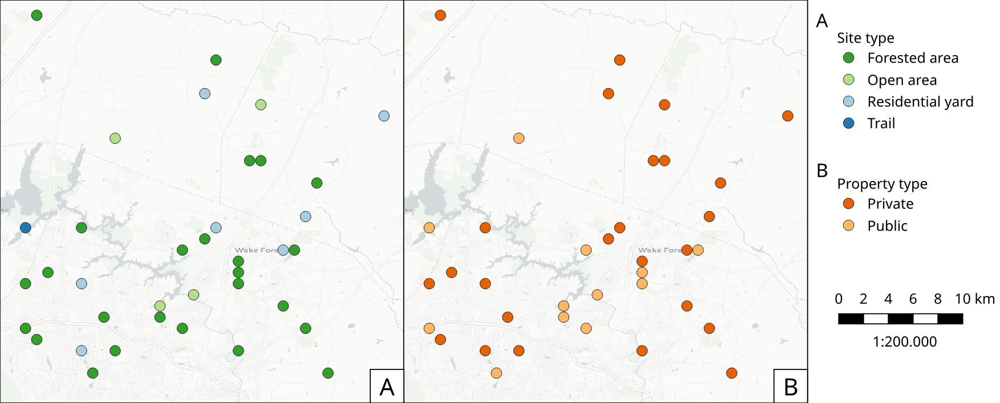

[[section-3]]
== Managing camera trap data

[NOTE]
====
TODO, add highlights here
====

Once a camera trap is operative in the field, it can generate hundreds, thousands or even millions of pictures or videos in the timeframe of the project. Ultimately, these data need to be analysed. But first, data need to be retrieved, stored, organized and labelled. The content of the images needs interpretation or annotation, either manually or facilitated by technology. All these steps are considered in the data management process.

Data management is one of the real bottlenecks in camera trap research. The massive amount of information stored on memory cards requires a high investment in terms of manpower and time. If data storage and classification is lagging behind, large volumes of data will remain unused and will get lost eventually. Manual extraction, organization and labelling can introduce human errors and can lead to data loss. In addition, there’s often more information in the image or video than the sole target species (group) or topic that is the focus of the project. Camera traps inherently detect multiple species and observations of nontarget species provide valuable data for other research objectives. If all data, including non target species, were annotated, more relevant outcomes to funds could be generated cite:[young-2018,wearn-2017].

To conclude, every researcher should pay attention to data hygiene. The underlying idea is: rather have ten well-documented elements, rather than a hundred poorly documented ones. Only in this way can we turn the cacophony of raw image data into useful quantitative data.

In this section, we introduce a number of general conventions for sound data management data. We zoom deeper into what camera trap data exactly is. For each type of camera trap data (<<project-metadata,metadata>>, <<media-files,media>>, <<deployments,deployments>>, <<observations,observations>>), we focus on how to best manage these, and what data management platforms you can use to facilitate you in doing so.

=== What are camera trap data

Intuitively, we associate camera trap data with the <<media>> files captured by the <<camera,cameras>>. But to be able to use these for research they need to be documented with additional information. Media files should be <<classification, classified>> to know what species were observed. Information on camera <<deployment>>, duration, <<location,location>>, <<alignment>> and sampling methodology is needed to know when, where and how likely those species were to be observed. Finally, we need information about the <<project,project/study>> as a whole to know the scope and who was involved.

Overall, we can distinguish four types of camera trap data:

* **Project metadata:** information about the camera trap project/study as a whole
* **Media files:** images, videos or sound files captured by the <<camera,cameras>>, including their <<EXIF>> metadata
* **Deployments:** information regarding the camera <<location>> and <<alignment>>, the sampling duration and <<covariates>>. Typically not automatically registered by the camera.
* **Observations:** information regarding what can be seen or heard on the media files (i.e. objects of interest), such as animals, humans or vehicles. The aim is typically to record what animal species were observed, optionally including information on their group size, life stage, sex and behaviour.

These data can be organized in different ways, based on personal preference or what <<data-management-system,data management system>> is used. We can however identify a number of core concepts, hereafter referred to as classes, that constitute a “model” for camera trap data (see <<figure-class-diagram>>). Those classes are project, organization, participant, deployment, location, device, media, sequence and observation.

.TODO, caption.
[#figure-class-diagram]

=== Project Metadata

Project metadata document a camera trap project/study as a whole. Who was involved, what was the rationale, what sampling methods were used and what was the scope? Projects can vary a lot in size and are sometimes part of meta-studies or subdivided in subprojects to better manage their hundreds of thousands of deployments (e.g. https://www.snapshot-usa.org/[Snapshot USA]). Describe projects at a level that makes sense. Is it possible to identify a person that can make decisions or answer questions about the project? Is it easy to describe the methodology? If the answer to those questions is no, then it might be better to consider those separate projects. Also note that we strongly recommend publishing data at project level, i.e. one dataset for one project (see <<section-4>>).

When published, project metadata are a substantial part of the dataset metadata (see <<figure-example-metadata>>), allowing others to discover your dataset when searching for certain keywords and to assess if it fits their research needs. When describing your project, think about what others would need to understand it. We recommend to cover the following aspects:

* Title
* Identifier and/or acronym
* Description (including rationale)
* Contributors and their roles (including organizations)
* Sampling design (simple random, systematic random, etc.)
* Capture method (motion detection and/or timelapse)
* Whether individual animals were tracked
* Geographic scope
* Temporal scope
* Taxonomic scope
* Link to website
* Keywords
* Funding

Data management systems typically organize this information into the following classes: 
<<project>>, <<subproject>>, <<organization>> and <<participant>> (see <<figure-class-diagram>>).

.Screenshot of a https://www.gbif.org/dataset/8a5cbaec-2839-4471-9e1d-98df301095dd[camera trap dataset] published on GBIF cite:[mica-dataset]. A substantial part of its metadata are derived from the project metadata.
[#figure-example-metadata]

==== Participants and roles

A <<participant>> is a person associated with a camera trap project. Information typically captured about a participant is their first name, last name, email, and ORCID. The role(s) of a participant is defined in relation to a project (e.g. principal investigator, contact person) and organization (e.g. researcher) (see <<figure-class-diagram>>). Different names are used for similar roles. We recommend simplifying those to a limited set of controlled values (e.g. https://tdwg.github.io/camtrap-dp/metadata/#contributors.role[Camtrap DP roles]) when publishing data (see <<table-roles>>).

[[table-roles]]
.Participant roles in camera trap studies, as defined by different formats and data management systems.
[%header,cols=7*]
|===
|Camtrap DP
|CTMS cite:[ctms]
|Wildlife camera metadata protocol cite:[risc-2019]
|Datacite cite:[datacite]
|EML cite:[eml-2015]
|Agouti cite:[agouti]
|Wildlife Insights cite:[wildlife-insights]

|contact
|ProjectContact
|Project Coordinator
|ContactPerson
|Point of Contact
|Project coordinator
|Project Owner

|principalInvestigator
|PrincipalInvestigator
|
|ProjectLeader
ProjectManager
Supervisor
|Owner
Principal Investigator
|Principal investigator
|Project Owner

|rightsHolder
|
|
|RightsHolder
|
|
|

|publishers
|
|
|Distributor
|Distributor
Publisher
|
|

|contributor
|sequenceIdentifiedBy
PhotoTypeIdentifiedBy
|Crew Member
Surveyor
|DataManager
DataCurator
DataCollector
ProjectMember
Researcher
|Curator
Editor
Author
Content Provider
Originator
|Admin
Taxonomic expert
Photo processor
Volunteer
|Project Editor
Project Contributor
Project Tagger

|
|
|
|Other
|User
Processor
Reviewer
Metadata Provider
|View only
Dummy
Awaiting access
|Project Viewer

|=== 

=== Media files

<<media-file,Media files>> are the raw data a camera trap collects. For most camera trap studies, these will be <<image,images>> (see <<figure-example-image>> for an example), but  modern camera traps can record other types of media types as well, such as <<video>> or sound. Videos can capture animal behaviour in more detail than images and are often suitable for outreach, but require more battery power, larger file sizes and are harder to process.

An often used compromise is to take a series of images when a camera is triggered (e.g. 10 images, 1 second apart). When processing the media files, those related images can be combined in a <<sequence>>. A sequence not only combines images resulting from a single <<trigger>>, but also consecutive triggers that fall within a preset <<independence-interval,independence interval>> (e.g. 120s). That way, continued <<activity>> is captured in a single sequence.

A camera also records metadata when creating a media file. This can include date and time, camera settings (like shutter speed, exposure level, flash status) and other properties. For images, this information is stored as part of the file and is expressed in the Exchangeable Image File Format (<<EXIF>>) (see <<table-exif>>). Metadata for videos is less standardised, although some formats like AVI and MOV support EXIF.

Data management systems typically organize media files and the associated metadata into the following classes: <<media>>, <<media-type,media type>> and <<sequence>> (see <<figure-class-diagram>>).

.An image captured by a camera trap deployed as part of the MICA project cite:[mica-project]. It is the fifth of a series of ten images and indicates the date, time and temperature. It is a black and white photo of a creek occupied by three birds: a grey heron (Ardea cinerea) in the foreground and a female and male mallard (Anas platyrhynchos) in the background. Source: https://multimedia.agouti.eu/assets/6d65f3e4-4770-407b-b2bf-878983bf9872/file.
[#figure-example-image]

[[table-exif]]
.Selected properties included in the EXIF metadata of the image in <<figure-example-image>>.
[%header,cols=2*]
|===
|Property
|Value

|File type
|JPEG

|MIME type
|image/jpeg

|Image width
|2048 pixels

|Image height
|1440 pixels

|Horizontal resolution
|72 dpi

|Vertical resolution
|72 dpi

|Exif version
|0220

|Make
|RECONYX

|Model
|HYPERFIRE 2 COVERT

|Date time original
|2020:06:12 06:04:32 UTC

|Time zone offset
|N/A

|Exposure time / shutter speed
|1/85

|ISO
|200

|Colour Space
|sRGB

|Flash
|Auto, Fired

|Exposure mode
|Auto

|White balance
|Manual

|Scene capture type
|Standard

|=== 

==== Timestamps

The date and time a media file was recorded is the most important aspect of its metadata. This information is used to assess when animals were observed and cannot be derived later (in contrast with e.g. <<location,location>>). Since this information is derived from the camera’s internal clock, it is critical to verify it is set correctly. We recommend setting the clock to https://en.wikipedia.org/wiki/Coordinated_Universal_Time[Coordinated Universal Time (UTC)] or local winter time. Disable automatic switching to summer time and record the used time zone as part of the <<deployment>>.

==== File naming

Media files are best managed by a <<data-management-system,data management system>>. If you manage your media files yourself, then we recommend the following file and directory naming conventions:

* Avoid renaming media file names. Rather, organize media files in one directory for each <<deployment>>. This also prevents raw file names from overlapping across cameras. Note that file paths may be used as identifiers in <<classification,classification>> data.
* Make sure that ordering files alphabetically also sorts them chronologically. This is likely already the case for sequentially assigned file names (e.g. `IMG_4545.jpg`). Otherwise, start the name with the date (`YYYYMMDD`) or datetime (`YYYYMMDD_HHMMSS`). This can also be useful for directory names.
* If you are naming files, use snake case (`image_1`), hyphen case (`image-1`) or camel case (`image1` or `videoFile1`) rather than whitespace (`image 1`). Avoid special characters.
* Do not store <<classification,classification>> information as part of the media file name.
* Be consistent.

[,ini]
----
# Good
PICT0001.JPG
20200709_093352.JPG

# Bad: can't be sorted chronologically
09072020_093352.JPG

# Bad: contains classification information
20200709_093352_Ardea_alba_1_Anas_platyrhynchos_male_female.jpg

# Bad: contains spaces and special characters
dep 2021 't WAD
----

==== Storage

=== Deployments

A <<deployment>> is the spatial and temporal placement of a <<camera>>. Deployments end by removing or replacing the camera, changing their position or swapping their memory card. The resulting <<media-file,media files>> are all associated with that deployment and are best organized as such. Deployment information includes camera <<location,location>>, duration, <<alignment>> and settings and other <<covariates,covariates>> such as bait use, feature type, habitat, canopy cover, etc. (see <<table-deployment>>). This information is not captured by the camera and needs to be recorded manually. Note that even the duration can be longer than the timestamp of the first and last captured media file.

Data management systems typically organize deployments into the following classes: <<deployment>>, <<location,location>>, <<camera>>, <<deployment-group,deployment group>> and <<subproject>> (see <<figure-class-diagram>>).

[[table-deployment]]
.Recorded information for the deployment that generated the image in <<figure-example-image>>. Source: https://tdwg.github.io/camtrap-dp/example/00a2c20d/
[%header,cols=2*]
|===
|Property
|Value

|Deployment ID
|00a2c20d

|Start date/time
|2020-05-30 02:57:37 UTC

|End date/time
|2020-07-01 09:41:41 UTC

|Location ID
|e254a13c

|Location name
|B_HS_val 2_processiepark

|Latitude
|51.496

|Longitude
|4.774

|Coordinate uncertainty
|187 m

|Other location information
|boven de stroom

|Camera set up by
|anonymized:3eb30aa

|Camera ID
|320

|Camera model
|Reconyx-HF2X

|Camera delay
|0 s

|Camera height
|1.30 m

|Camera tilt
|-15 °

|Camera heading
|285 °

|Detection distance
|3.20 m

|Timestamp issues
|false

|Bait use
|false

|habitat
|Campine area with a number of river valleys with valuable grasslands

|===

==== Column naming

Deployment information is best recorded in a <<data-management-system,data management system>>. If you manage your deployment information elsewhere (e.g. a spreadsheet), then we recommend the following column naming conventions:

* Use descriptive names, so users have an idea of what information to expect.
* Separate words using snake case (`deployment_location_1`), hyphen case (`deployment-location-1`) or camel case (`deploymentLocation1`) rather than whitespace (`deployment location 1`). Snake case ensures the highest level of interoperability between systems, camelCase is most often used in data standards.
* Avoid abbreviations to mitigate the risk of confusion, except for well known words like `ID` for identifier.
* Avoid including units and data types. Describe these elsewhere (e.g. in a separate sheet, README document or https://specs.frictionlessdata.io/table-schema/[Table Schema]), together with the column definition and controlled values.
* Be consistent.

[,ini]
----
# Good
scientificName
deployment_group

# Bad: contains spaces
scientific name

# Bad: abbreviated
dep_gr

# Bad: inconsistent naming
latitude & coordinatesLongitude

# Bad: includes unit or data type
camera_height_meter_double
----

==== Location

A <<location,location>> is the physical place where a camera is located during a deployment. It can be described with a name, identifier and/or description, but we recommend always to record the https://docs.gbif.org/georeferencing-best-practices/1.0/en/#coordinates-geographic-coordinates[geographical coordinates]. Those are most commonly expressed as latitude and longitude in decimal degrees, using the https://docs.gbif.org/georeferencing-best-practices/1.0/en/#WGS84[WGS84] datum.

The coordinates are best determined using a GPS receiver at the location itself. If this is not possible, use (online) resources and georeferencing best practices cite:[chapman-2020] to obtain those. In addition to the coordinates and geodetic datum (e.g. WGS84) it is important to record the https://docs.gbif.org/georeferencing-best-practices/1.0/en/#calculating-uncertainties[uncertainty of the coordinates], which is affected by several factors:

* The https://docs.gbif.org/georeferencing-best-practices/1.0/en/#extent-of-a-location[extent] of the location. Note that for camera traps this includes the <<detection-distance,detection distance>>, which is typically between 5 and 20m.
* The accuracy of the GPS receiver or georeferencing resource. Most GPS receivers obtain an accuracy of 5 metres in open areas when using four or more satellites cite:[chapman-2020]. Forest canopy or limited satellite connection can reduce accuracy. Google Maps or Open Street Maps have an accuracy of 8m cite:[chapman-2020].
* The https://docs.gbif.org/georeferencing-best-practices/1.0/en/#uncertainty-related-to-coordinate-precision[coordinate precision]. The less precise (and closer to the equator) the higher the uncertainty, e.g. WGS84 coordinates with a precision of 0.001 degree have an uncertainty of 157m at the equator (see https://docs.gbif.org/georeferencing-best-practices/1.0/en/#table-uncertainty[Table 3] in citenp:[chapman-2020]).
* An https://docs.gbif.org/georeferencing-best-practices/1.0/en/#uncertainty-from-unknown-datum[unknown datum]. This can range from centimetres to kilometres cite:[chapman-2020], so it is important to always record the datum used by the GPS receiver or georeferencing resource (WGS84 for Google Maps or Open Street Maps).
* The combined maximum uncertainty is most conveniently expressed as a coordinate uncertainty in metres, allowing the location to be described with the point-radius-method.

The combined maximum uncertainty is most conveniently expressed as a coordinate uncertainty in metres, allowing the location to be described with the https://docs.gbif.org/georeferencing-best-practices/1.0/en/#point-radius-method[point-radius-method].

Most other properties associated with a location such as country and state, but even elevation, slope, land cover or leaf area index, can be derived from the coordinates using an online resource.

==== Camera model, settings and alignment

Since a deployment relates to the placement of a <<camera>>, it is important to capture information regarding its model, settings and alignment. The model consists of the manufacturer and model name (e.g. `Reconyx-PC800`). Except for the <<quiet-period,quiet-period>>, most camera settings are typically automatically recorded as part of the <<EXIF>> metadata. The <<detection-distance,detection distance>> can vary a lot depending on terrain and vegetation and is best measured in the field by having someone move in front of the camera at different distances. The <<alignment>> is the physical placement of a <<camera>> in 3D space. It consists of <<camera-height,camera height>>, <<camera-tilt,camera tilt>> and <<camera-heading,camera heading>>.

==== Deployment groups

It can be useful to categorize deployments in <<deployment-group,deployment groups>> to facilitate their data management and analysis. A deployment group can be thematic (e.g. paired deployment), spatial (e.g. private land, open woodland) or temporal (e.g. summer 2005) in nature (see <<figure-deployment-groups>>). A single deployment can belong to zero or more deployment groups.
<<subproject,Subprojects>> are a special kind of deployment group used to subdivide very large projects containing many thousands of deployments. This facilitates their management. A single deployment can belong to a single subproject.

.Map showing a selection of deployments from the NC Candid Critters project cite:[candid-critters-project]. Deployments can be categorized differently based on the <<deployment-group,deployment group(s)>> they belong to. Left (A): deployment groups representing site type (forested area, open area, residential yard, trail), right (B): deployment groups representing property type (private, public). The project also used <<subproject,subprojects>> to group deployments per county (not show on figure).
[#figure-deployment-groups]

==== Covariates

Covariates are variables that may affect the behaviour and thus detection of animals. Recording those is important for further analysis of the data. <<bait,Bait>>, <<feature-type,feature type>> and <<habitat-type,habitat type>> are commonly recorded covariates. as part of the deployment. What and how to record covariates should be consistent within a project, but is typically not so across projects, unless they form part of a larger well-coordinated research study.  To aid interoperability, we recommend making use of existing classification systems to record covariates:

* Biomes/ecoregions cite:[dinerstein-2017]
* Ecological traits:
** COMBINE cite:[soria-2021]
** PanTHERIA cite:[jones-2009]
** EltonTraits cite:[wilman-2014]
** AmphBIO cite:[oliveira-2017]
** GlobTerm cite:[bennett-2018]
** AVONET cite:[tobias-2022]
** https://opentraits.org/datasets.html[Open Traits Network]
* Habitat classification cite:[jung-2020]
* Land cover products cite:[yang-2017,amatulli-2018] (http://www.earthenv.org)
* Land cover type cite:[buchhorn-2020]
* Leaf Area Index cite:[law-2008]
* Primary productivity cite:[zhao-2005]
* Terrain ruggedness index (TRI) cite:[riley-1999]

=== Observations

<<observation,Observations>> are an interpretation of what can be seen or heard on <<media-file,media files>>. These are not limited to species observations, but can also indicate whether the media file contains a vehicle, human or unknown object, or that nothing of interest was observed (<<blank,blanks>>). That is why they are sometimes also called classifications, annotations or identifications. The aim is typically to record what animal species were observed, optionally including information on their group size, life stage, sex and behaviour (see <<table-observation>>).

Observations are best recorded in a <<data-management-system,data management system>>, which will typically organize observations into the following classes: <<observation>>, <<observation-type>> and <<sequence>> (see <<figure-class-diagram>>). If you manage your observation information elsewhere (e.g. a spreadsheet), then we recommend to follow the same <<column-naming,column naming conventions>> as for deployments.

[[table-observation]]
.Recorded information for one of the observations that is based on the image in <<figure-example-image>>. It is classified at event level (sequence) in the camera trap management system Agouti. Source: https://tdwg.github.io/camtrap-dp/example/00a2c20d/#79204343
[%header,cols=2*]
|===
|Property
|Value

|Observation ID
|05230014

|Observation type
|animal

|Taxon ID
|GCHS

|Scientific name
|Ardea cinerea

|Count
|1

|Life stage
|adult

|Classification method
|human

|Classified by
|Peter Desmet

|Classification timestamp
|2023-02-02T13:57:58Z

|===

==== Classification

Unfortunately, camera traps don’t provide observations directly. Media need to be <<classification,classified>> to obtain observations. This process can be performed in different steps and with different levels of precision and granularity:

* Media does or <<blank,does not>> contain object(s) of interest.
* Object(s) of interest is a human or vehicle, or cannot be identified.
* Object(s) of interest is an animal, identified at a high taxonomic level (e.g. a rodent).
* Animal is identified at species or subspecies level (e.g. _Sus scrofa_).
* Animal is identified as a known individual (e.g. wolf Noëlla).
* Other properties of the animal are recorded, such as group size, life stage, sex, and behaviour.

Different actors (experts, volunteers, AI) can reach different levels of precision, based on their expertise (can I reach such a precision?) and effort (do I want to reach such a precision?). Since classification can be very labour intensive for larger studies, it is best to use an approach that yields the necessary data efficiently. Citizen scientists, artificial intelligence and/or classifying <<event,events>> rather than individual <<media>> can help to speed up the process cite:[green-2020]. Whatever the technique, we recommend to always record who made the classification and what type of technique (human vs machine) was used.

==== Citizen science

<<citizen-science,Citizen scientists>> are volunteers from the non-scientific community that help scientists in their work. They can contribute to camera trap studies in a number of ways, such as placing cameras and collecting/swapping memory cards. In a practice called crowdsourcing, researchers can also distribute the task of  <<classification,classifying>> media, by presenting these online to a community of citizen scientists. Each classification helps to confirm or improve the community's opinion on the observed species cite:[swanson-2015,hsing-2018].

Most projects use established online platforms for crowdsourcing cite:[forston-2012,swanson-2015], (https://www.zooniverse.org/projects/sassydumbledore/chimp-and-see[Chimp&See]), such as Zooniverse cite:[simpson-2014], MammalWeb cite:[bradley-2017], Digivol cite:[alony-2020] or DoeDat cite:[groom-2018]. These platforms give access to large, already existing volunteer bases, which is particularly important if classifications are needed within a short time frame. Note however that managing a citizen science project takes time and might be more beneficial for larger studies. In addition to uploading media to a platform, waiting for classifications, downloading consensus observations and dealing with non-consensus observations, you need to keep the community engaged and/or attract new members. It is also important to exclude sensitive media from the process, such as media containing humans (to protect their privacy) and rare species. This will require some type of preprocessing, which is where artificial intelligence (AI) comes in cite:[weinstein-2018].

==== Artificial intelligence

In the context of camera trap research, artificial intelligence (AI) typically refers to the use of <<computer-vision,computer vision>> for <<classification,classification>>. These computer models are <<machine-learning,trained>> with already classified datasets and can process millions of media in a fraction of a time it would take a human cite:[norouzzadeh-2020]. The field has seen significant advancements in recent years and models are now able to filter out <<blank,blanks>> and media containing humans, recognize species, count or track individuals, as well as recognize individual animals cite:[price-tack-2016,gomez-villa-2017,nguyen-2017,brides-2018,norouzzadeh-2020,yousif-2018]. New models are coming out every year, but especially their incorporation in <<data-management-system,data management systems>> will increase their use, especially by users that have no experience in machine learning. As such, computer vision will likely become the dominant technique to classify camera trap data in the near future.

Still, computer vision won’t entirely replace human <<classification,classification>>, since a large and diverse number of preprocessed data are needed to train the models. Unbalanced training datasets may produce low performance of the models, such as training datasets with a highly variable number of images of each species, or small and geographically limited datasets. Additionally, the accuracy of computer vision classification is currently still secondary to that of a human expert. A combination of AI-aided preprocessing and human verification is therefore recommended.

==== Media or event based classification

Classifications can be based on a single media file (typically an <<image>>) or an <<event>> (typically a <<sequence>> of images). In the latter technique, all media files that belong to the <<event>> are assessed as a whole to determine the species and their number of individuals. This is less time consuming for human classifiers and can lead to better estimates of group size, since the number of individuals passing by a camera can be larger than those that can be seen in a single image. The disadvantage of event based classification is that it is not possible to split the classification into events that are shorter than the one that is assessed (the same is true for videos classified as a whole). Nor can those classifications be used to train computer models, which require media based training datasets.

As a result, <<data-management-system,data management systems>> may favour one technique over the other, or offer both. Resulting datasets can include media based, event based or both types of classifications.

==== Common or scientific names

Media can be classified using common (e.g. roe deer) or scientific names (e.g. _Capreolus capreolus_) for taxa. Common (or vernacular) names are easier to remember and allow for better public engagement. The downside is that they are subject to translation, can vary regionally, sometimes refer to different species (e.g. “elk” in North America refers to _Cervus canadensis_, while in Europe it is used for _Alces alces_) and might not exist for every species or language combination. Scientific names on the other hand follow strict nomenclatural rules, are globally consistent and are not subject to translation. We therefore recommend to always store the scientific name as part of the observation, even if only common names are presented to the user.

The list of scientific names that are available for <<classification,classification>> in a project is best maintained in a single reference table. This facilitates the management of taxonomic classification and associated common names, and allows to restrict classification options to those species that are likely to occur. More taxa can be added if needed, but only after verification. This practice is used by most <<data-management-system,data management systems>>. To populate such a reference table, we recommend using an authorative source (see <<table-taxon-reference-sources>>) and storing the taxon identifiers used by that source as reference.

[[table-taxon-reference-sources]]
.Selection of sources for scientific names, common names and taxonomic information.
[%header,cols=3*]
|===
|Source
|Taxonomic coverage
|Use for

|Catalogue of Life cite:[col-2023]
|All
|Scientific names
Common names (select languages)
Taxonomy

|https://en.wikipedia.org/[Wikipedia] (English and other language versions)
|All
|Common names (many languages)

|Clements Checklist of Birds of the World cite:[clements-2022]
|Birds
|Scientific names
Common names (English)
Taxonomy

|(http://datazone.birdlife.org/species/search)[Birdlife International's taxonomy]
|Birds
|Scientific names
Common names (English)
Taxonomy

|https://www.iucnredlist.org/[IUCN Red List of Endangered Species]
|Mammals
|Scientific names
Common names (select languages)
Taxonomy

|https://www.mammaldiversity.org/[American Society of Mammalogists Mammal Diversity Database]
|Mammals
|Scientific names
Common names (English)
Taxonomy

|===

=== Data management systems

Managing camera trap data can be daunting, especially for larger projects. Luckily, a number of software tools and platforms have been developed to help researchers with some or all of the aspects of camera trap data managements cite:[young-2018]. These initiatives were often started by research teams to facilitate their own needs, but some have grown to mature systems that can be used by anyone. We discuss and recommend five of those below (see <<table-data-management-systems>> for an overview of their features). They support the entire life cycle of camera trap data management:

* Create one or more projects
* Invite <<participant,collaborators>> with different levels of access
* Upload media and creating deployments
* <<classification,Classify>> media to observations, optionally supported by <<computer-vision,AI>> and <<citizen-science,citizen science>>
* Manage reference lists of species, locations, covariates, etc.
* Engage the public by making some or all project metadata available on a website
* Export data in a standardized format for further analysis and data publication
* Archive data, including media files

==== Agouti

Agouti cite:[agouti] (https://agouti.eu) is an online system for managing camera trap data. It is maintained by Wageningen University & Research and the Research Institute for Nature and Forest (INBO), based respectively in the Netherlands and Belgium. Agouti is mainly used by European projects and is free to use.

Classification is event based, but animal positions can be recorded at media level, allowing to record the necessary data for distance analyses cite:[howe-2017] and random encounter modelling cite:[rowcliffe-2011]. AI classification is possible, using a dedicated species classification model that is updated regularly. Media containing humans are always hidden from the public. Data are stored on university infrastructure, which also offers long term archival and hotlinking to media. Project metadata can be made available via a public portal. Data can be exported as <<camtrap-dp,Camtrap DP>>.

Agouti is a good choice for organizations who want a free full-feature European based service.

==== Camelot

Camelot cite:[camelot] (https://camelotproject.org/) is a local system for managing camera trap data. It is maintained as a volunteer initiative based in Australia. Camelot is free to use, open source, available for all major operating systems and requires installation. It is typically used as a local desktop application, but can be set up on a server allowing multiple users to connect via their browser. Classification is media based with the option to classify multiple media at once. AI classification is not offered. Data can be exported in a custom format.

Camelot is a good choice for organizations and individuals who want a light-weigh solution they can manage themselves.

==== TRAPPER

TRAPPER cite:[trapper] (https://os-conservation.org/projects/trapper) is an online system for managing camera trap data. It is maintained by the Open Science Conservation Fund, based in Poland. TRAPPER is mainly used by European projects and is free to use. The software is open source and requires installation and hosting. Classification is media based with the option to classify multiple media at once. AI classification is possible, using existing species classification models. Data can be exported as <<camtrap-dp,Camtrap DP>>.

TRAPPER is a good choice for organizations who want control over the software and where their data are stored.

==== Wildlife Insights

Wildlife Insights cite:[wildlife-insights] (https://www.wildlifeinsights.org/) is an online system for managing camera trap data. It is maintained by Conservation International, Google and other partners, based in the United States. Wildlife Insights is mainly used by projects in the Americas and uses a tiered subscription model (including free tiers). Uploaded media are automatically classified at media level by AI, using a dedicated species classification model developed by Google. Media containing humans are always hidden from the public. Further classification has the option to classify multiple media at once. Data are stored in the cloud, can be used by Wildlife Insights to train AI and must be made public after a maximum embargo period of maximum 48 months. Project metadata is always available via a public portal. Data can be exported in a custom format, based on CTMS cite:[ctms].

Wildlife Insights is a good choice for organizations who want a full-feature service with powerful AI and open data requirements.

==== Wildtrax

WildTrax cite:[wildtrax] (https://www.wildtrax.ca/) is an online system for managing camera trap data. It is maintained by the University of Alberta, based in Canada. Wildtrax is mainly used by Canadian projects and is free to use (except for very large projects). Classification is media based with the option to classify multiple media at once. AI classification is possible, but only at a broad level (blanks, animals, vehicles), species classification is not (yet) offered. Data are stored in the cloud. Project metadata can be made available via a public portal. Data can be exported in a custom format (with associated R package).

Wildtrax is a good choice for organizations who want a free service based in Canada.

[[table-data-management-systems]]
.Comparison of features offered by five data management systems. Features that are the same for all systems are not shown.
[%header,cols=5*]
|===

|Platform
|Agouti
|Camelot
|TRAPPER
|Wildlife Insights

|Provided as
|Service
|Software
|Software
|Service

|Cost
|Free
|Free
|Free
|Tiered subscription model (incl. free)

|Open source
|No
|Yes
|Yes
|No

|Supported media types
|Image, Video
|Image
|Image, Video
|Image

|Multiple users roles
|Yes
|Yes (limited)
|Yes
|Yes

|Supported languages
|English, Croatian, Dutch, French, German, Polish, Spanish
|English
|English?
|Many (via Google translate)

|Media or event based classification
|Event based
|Media based
|Media based?
|Media based?

|AI classification
|Yes (species classification)
|No
|Yes (species classification)
|Yes (species classification)

|Integration with crowdsourcing platform
|Yes (Zooniverse)
|No
|Yes (Zooniverse?
|No

|Project portal
|Yes
|No
|No
|Yes

|Data storage
|University infrastructure
|Own server
|Own server or cloud
|Cloud (Google Cloud Platform)

|Data rights granted to system
|Minimal
|None
|None
|Some (e.g. for training AI and summary data products)

|Open data requirement
|No (but recommended)
|No
|No (but recommended)
|Yes (data can be kept private for 48 months, project metadata are always public)

|Media hosting
|Yes
|No
|Yes?
|Yes?

|Export format
|Camtrap DP
|Custom format
|Camtrap DP
|Custom format

|===
