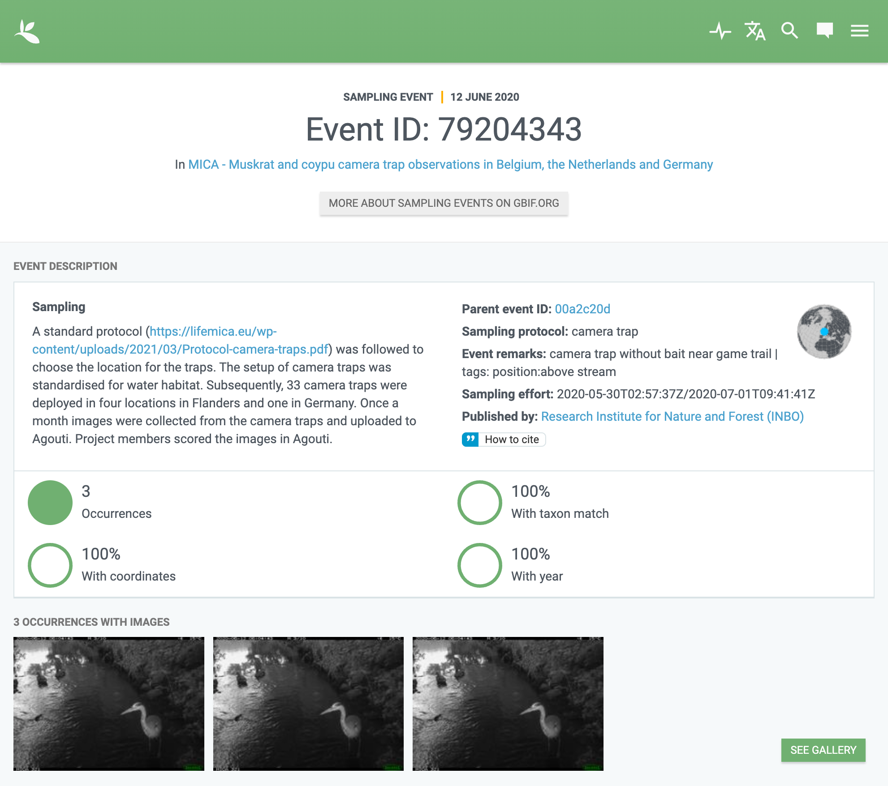

[#section-4]
== Publishing camera trap data

Data publication is the process of making biodiversity data open and <<FAIR>> (findable, accessible, interoperable and reusable, citenp:[wilkinson-2016]). The best way to do this is by depositing your data in a <<data-repository,data repository>>. Repositories are specifically designed to find, aggregate, provide access and store research data. We recommend the use of the GBIF IPT as a data repository to publish and register your dataset with GBIF. 

Publishing data through GBIF requires data preparation (<<section-preparing-data>>) and standardization. Data standardization is the transformation of data to a specific <<data-exchange-format,data exchange format>> so it becomes interoperable with other data at GBIF. GBIF supports <<camtrap-dp,Camtrap DP>> and <<darwin-core-archive,Darwin Core Archive>> as the data exchange formats for camera trap data. Recommendations for these formats are provided in <<section-camtrap-dp>> and <<section-darwin-core-archive>> respectively.

////
See https://www.gbif.org/publishing-data
Mention 1 study = 1 dataset
////

[#section-preparing-data]
=== Preparing data

[#section-stable-unique-identifiers]
==== Stable unique identifiers

Terms like {deployments-deploymentID} or term:dwc[dwc:occurrenceID] expect an identifier that is:

* Required to be **unique**, i.e. it uniquely refers to a record or concept.
* Strongly recommended to be **stable**/persistent, i.e. it does not change over time and can safely be referenced.
* Recommended to be **globally unique**, i.e. it uniquely refers to a record or concept in a global context.

If available, we recommend using the identifier assigned by the <<data-management-system,data management system>>, as is. These identifiers will be unique, most likely stable, and sometimes globally unique (e.g. a <<UUID,UUID>>). They also allow users (with access) to look up the record in the data management system. We advice against appending elements to the identifier to make it globally unique, since this makes it more prone to change. Since datasets can be uniquely identified (e.g. with a DOI), it is sufficient if the identifier is unique within the dataset.

[#section-sensitive-information]
==== Sensitive information

Camera trap data may contain sensitive information, such as personal information (e.g. names or images of living persons), the occurrence of sensitive (e.g. rare or endangered) species, the locations of actively managed cameras, or even notes and comments not intended for the public. We recommend following the best practices in citenp:[chapman-2020], which favour generalization over restriction of the record as a whole.

[#section-personal-data]
===== Personal data

Personal data is any information that relates to an identified or identifiable living person. This information is subject to regulations such as <<GDPR>>. In camera trap data, personal data are the names of <<participant,participants>>, their email addresses and the whereabouts of participants who setup the camera (identifiable by combining the name with the deployment datetime and <<location>>). In <<camtrap-dp,Camtrap DP>>, person names can appear in {package-contributors}, {package-bibliographicCitation}, {deployments-setupBy} and {observations-classifiedBy}. In a <<darwin-core-archive,Darwin Core Archive>>, person names can appear in the metadata and terms like term:dwc[dwc:identifiedBy].

We recommend contacting participants to ask if their personal information can be made public and to anomyze (e.g. `anonymized:3eb30aa`) or exclude it when they prefer not to. Some <<data-management-system,data management system>> (such as citenp:[agouti]) allow users to indicate their preferences and automatically anonymize their personal data in exports. Note that it may not be possible to permanently remove personal information from older versions of an already published dataset.

[#section-sensitive-media-files]
===== Sensitive media files

<<media-file,Media files>> containing identifiable persons is a form of <<section-personal-data,personal data>> that should be identified and kept private in order to protect the privacy of the persons. The same may be necessary for media files containing vehicles or picturing camera <<setup>>. Media files containing sensitive species may need to be kept private if they allow to identify the location.

We recommend providing the URL to all media files (in {media-filePath} or https://ac.tdwg.org/termlist/#ac_accessURI[ac:accessURI] ), but regulating its access at the provider level. The expected access can be described in {media-filePublic} or https://ac.tdwg.org/termlist/#ac_serviceExpectation[ac:serviceExpectation]. Note that in a <<darwin-core-archive,Darwin Core Archive>>, observations (and media) of humans, vehicles, setup, etc. are typically excluded.

[#section-sensitive-location-information]
===== Sensitive location information

Camera trap data may contain <<location>> information of sensitive species. Locations of actively managed cameras can also be sensitive to vandalism and theft. We recommended following citenp:[chapman-2020] to determine sensitivity (https://docs.gbif.org/sensitive-species-best-practices/master/en/#determining-sensitivity[Chapter 2]) and choose an appropriate generalization.

[CAUTION]
====
Note that camera trap location information is often the same across multiple <<deployment,deployments>>. Generalizing the coordinates of the deployment with associated sensitive information is likely not sufficient to prevent correlational analyses. A {deployments-locationID} shared by multiple deployments for example can lead to deductions of localities/records that are generalized. Make sure to generalize the coordinates for the <<location>> across deployments.
====

Whatever the selected level of generalization, document it in the dataset metadata and appropriate terms, so that users are aware. See <<table-generalization>> for an example.

[#table-generalization]
.How to express non-generalized vs generalized location information in Camtrap DP and Darwin Core. The generalized example assumes a sensitivity of https://docs.gbif.org/sensitive-species-best-practices/master/en/#cat4[Category 4]. The coordinate uncertainty of 187 meter is the sum of the GPS precision (30 m) and maximum uncertainty associated with coordinates that have a precision of 0.001 degree (157 m).
[%header,cols=4*]
|===
|Camtrap DP term
|Darwin Core term
|Non-generalized
|Generalized

|{deployments-latitude}
|term:dwc[dwc:decimalLatitude]
|51.18061
|51.181

|{deployments-longitude}
|term:dwc[dwc:decimalLongitude]
|5.65490
|5.655

|implied
|term:dwc[dwc:geodeticDatum]
|EPSG:4326
|EPSG:4326

|{deployments-coordinateUncertainty}
|term:dwc[dwc:coordinateUncertaintyInMeters]
|30
|187

|{package-coordinatePrecision}
|term:dwc[dwc:coordinatePrecision]
|0.00001
|0.001

|
|term:dwc[dwc:georeferenceRemarks]
|source assumed to be GPS, uncertainty defaulted to 30 m
|source assumed to be GPS, uncertainty defaulted to 30 m

|
|term:dwc[dwc:dataGeneralizations]
|
|coordinates rounded to 0.001 degree
|===

[#section-other-sensitive-information]
===== Other sensitive information

Text fields such as comments and notes (e.g. {deployments-deploymentComments} or term:dwc[dwc:occurrenceRemarks]) may contain sensitive information such as <<section-personal-data,person names>>, <<section-sensitive-location-information,sensitive location information>> or information not intended for the public. We recommend verifing values and generalizing where necessary (see https://docs.gbif.org/sensitive-species-best-practices/master/en/#generalizing-textual-information[Chapter 3] in citenp:[chapman-2020]).

[#section-camtrap-dp]
=== Camtrap DP

We recommend the use of <<camtrap-dp,Camera Trap Data Package (Camtrap DP)>> to publish camera trap data. It is specifically designed for this type of data and can retain more information than a <<darwin-core-archive,Darwin Core Archive>> cite:[bubnicki-2023]. Some <<data-management-system,data management systems>> directly support it as an export format (see <<table-data-management-systems>>), reducing the need for data transformation when publishing through GBIF.

See the https://tdwg.github.io/camtrap-dp/[Camtrap DP website] for term definitions, recommendations and examples.

[NOTE]
====
At the time of writing, GBIF does not yet support the publication of Camtrap DP in their production environment. It will be released as a feature in version 3 of the Integrated Publishing Toolkit (https://www.gbif.org/ipt[IPT]).
====

Not all information in a published Camtrap DP is currently harvested by GBIF. The GBIF data model requires it to be transformed to Darwin Core before ingestion. This process is provided by the https://inbo.github.io/camtraptor/reference/write_dwc.html[`write_dwc()`] function in the R software package camtraptor cite:[camtraptor]. This function implements the <<section-darwin-core-archive,recommendations>> suggested in this document. GBIF will be able to process more information from a published Camtrap DP once it has implemented a new data model cite:[gbif-2022].

[#section-darwin-core-archive]
=== Darwin Core Archive

[#section-why-not-a-sampling-event-dataset]
==== Why not a sampling event dataset?

With their hierarchical events (<<deployment,deployments>>, <<sequence,sequences>>) and resulting <<observation,observations>>, it seems logical to express camera trap data as https://www.gbif.org/sampling-event-data[Sampling-event data] with an {event-core} (see <<table-event-core>>) and an {occurrence-extension} (see <<table-occurrence-extension>>). It allows us to provide detailed (though repeated) information about each type of event and offers the possiblity to add a {mof-extension} with <<alignment>> and other information (mostly relevant for the deployments).

It unfortunately also **impedes us from expressing information about the <<media>> as an extension**, since the star schema design of a <<darwin-core-archive,Darwin Core Archive>> does not allow to relate the {occurrence-extension} with an {ac-extension}. It is techniqually possible to link the {ac-extension} with the {event-core}, but the media would then not be linked to the occurrences and not appear on occurrence pages at GBIF.org. The only available option to express information about the media at an occurrence level would be to use term:dwc[dwc:associatedMedia], which would reduce it to a (list of) URL(s). License, media type, capture method, bounding boxes, etc. cannot be provided.

[#table-event-core]
.{event-core} with camera trap data. It contains three types of events: one <<deployment>> (with a duration of days), one <<sequence>> (with a duration of seconds) and two <<media>>-based events (with a single timestamp). Note that location information is the same for all events. https://tdwg.github.io/camtrap-dp/example/00a2c20d/#79204343[Source].
[%header,cols=5*]
|===
|eventType
|eventID
|parentEventID
|eventDate
|Location information

|deployment
|00a2c20d
|
|2020-05-30T02:57:37Z/
2020-07-01T09:41:41Z
|51.496, 4.774

|sequence
|79204343
|00a2c20d
|2020-06-12T04:04:29Z/
2020-06-12T04:04:55Z
|51.496, 4.774

|media
|e68deaed
|79204343
|2020-06-12T04:04:29Z
|51.496, 4.774

|media
|c5efbcb3
|79204343
|2020-06-12T04:04:30Z
|51.496, 4.774
|===

[#table-occurrence-extension]
.{occurrence-extension} with camera trap data. It contains three observations: two <<#section-media-or-event-based-classification,media based>> classifications of _Anas platyrhynchos_ and one event based classification of _Ardea cinerea_. Information about the media files can only be provided in term:dwc[dwc:associatedMedia]. https://tdwg.github.io/camtrap-dp/example/00a2c20d/#79204343[Source].
[%header,cols=4*]
|===
|occurrenceID
|eventID
|scientificName
|associatedMedia

|e68deaed_2
|e68deaed
|Anas platyrhynchos
|[.break-all]#https://multimedia.agouti.eu/assets/e68deaed-a64e-4999-87a3-9aa0edf5970d/file#

|c5efbcb3_2
|c5efbcb3
|Anas platyrhynchos
|[.break-all]#https://multimedia.agouti.eu/assets/c5efbcb3-34f5-4a59-bc15-034e01b05475/file#

|05230014
|79204343
|Ardea cinerea
|[.break-all]#https://multimedia.agouti.eu/assets/e68deaed-a64e-4999-87a3-9aa0edf5970d/file  \|
https://multimedia.agouti.eu/assets/c5efbcb3-34f5-4a59-bc15-034e01b05475/file#
|===

We therefore recommend expressing camera trap data as an Occurrence dataset with an {occurrence-core} and an {ac-extension} (see <<table-occurrence-core>> and <<table-ac-extension>>). This treats **media as primary data records**, which is important given that they are the evidence on which the observations are based. Event hierarchy can largely be retained as well, since the {occurrence-core} allows to group occurrences into events (term:dwc[dwc:eventID]) and parent events (term:dwc[dwc:parentEventID]). By providing the <<event>>/sequence identifier in term:dwc[dwc:eventID] and <<deployment>> identifier in term:dwc[dwc:parentEventID], observations can be grouped just like they would in an {event-core} and GBIF.org will automatically create event pages for those (see <<figure-example-event-page>>). Event duration information however cannot be provided, but <<section-eventdate,eventDate>> and <<section-samplingeffort,samplingEffort>> can retain most of it. Information about the deployment location, habitat, sampling protocol, etc. is repeated for every observation in the deployment.

Term recommendations for the {occurrence-core} and {ac-extension} are provided in <<section-occurrence-core>> and <<section-ac-extension>> respectively.

[#table-occurrence-core]
.{occurrence-core} with camera trap data. It contains the same three observations as in <<table-occurrence-extension>>. The event/sequence identifier is provided in term:dwc[dwc:eventID], the deployment identifier in term:dwc[dwc:parentEventID]. https://tdwg.github.io/camtrap-dp/example/00a2c20d/#79204343[Source].
[%header,cols=6*]
|===
|occurrenceID
|eventID
|parentEventID
|scientificName
|eventDate
|Location information

|e68deaed_2
|79204343
|00a2c20d
|Anas platyrhynchos
|2020-06-12T04:04:29Z
|51.496, 4.774

|c5efbcb3_2
|79204343
|00a2c20d
|Anas platyrhynchos
|2020-06-12T04:04:30Z
|51.496, 4.774

|05230014
|79204343
|00a2c20d
|Ardea cinerea
|2020-06-12T04:04:29Z/
2020-06-12T04:04:55Z
|51.496, 4.774
|===

[#table-ac-extension]
.{ac-extension} with camera trap data. It contains the same two media files as referenced in <<table-occurrence-extension>>, but now allows to share more information per file. https://tdwg.github.io/camtrap-dp/example/00a2c20d/#79204343[Source].
[%header,cols=6*]
|===
|observationID
|identifier
|accessURI
|CreateDate
|captureDevice
|rights

|e68deaed_2
|e68deaed
|[.break-all]#https://multimedia.agouti.eu/assets/c5efbcb3-34f5-4a59-bc15-034e01b05475/file#
|2020-06-12T04:04:29Z
|Reconyx-HF2X
|[.break-all]#https://creativecommons.org/licenses/by/4.0/legalcode#

|c5efbcb3_2
|c5efbcb3
|[.break-all]#https://multimedia.agouti.eu/assets/c5efbcb3-34f5-4a59-bc15-034e01b05475/file#
|2020-06-12T04:04:30Z
|Reconyx-HF2X
|[.break-all]#https://creativecommons.org/licenses/by/4.0/legalcode#

|05230014
|e68deaed
|[.break-all]#https://multimedia.agouti.eu/assets/c5efbcb3-34f5-4a59-bc15-034e01b05475/file#
|2020-06-12T04:04:29Z
|Reconyx-HF2X
|[.break-all]#https://creativecommons.org/licenses/by/4.0/legalcode#

|05230014
|c5efbcb3
|[.break-all]#https://multimedia.agouti.eu/assets/c5efbcb3-34f5-4a59-bc15-034e01b05475/file#
|2020-06-12T04:04:30Z
|Reconyx-HF2X
|[.break-all]#https://creativecommons.org/licenses/by/4.0/legalcode#
|===

.Screenshot of an https://www.gbif.org/dataset/8a5cbaec-2839-4471-9e1d-98df301095dd/event/79204343-27df-401d-bfbd-80366e848fd5[event page] created by GBIF.org from information provided in an {occurrence-core} (based on row 3 in <<table-occurrence-core>>). Notice the event ID (a sequence) and parent event ID (a deployment).
[#figure-example-event-page]

[#section-occurrence-core]
==== Occurrence core

As described <<section-why-not-a-sampling-event-dataset,above>>, we recommend to use of an {occurrence-core} for expressing camera trap data as a <<darwin-core-archive,Darwin Core Archive>>. See <<table-occurrence-core>> for term recommendations. These recommendations align with the GBIF quality requirements for Occurrence datasets cite:[gbif-2020] and use the same terminology (Required, Strongly recommended, Share if available).

Note that the {occurrence-core} should only contain <<observation-type,animal observations>>, so classifications of <<blank,blanks>>, vehicles and preferrably <<section-sensitive-media-files,humans>> should be filtered out. The number of records will depend on the size of the study, the classification effort (are all media classified?), the classification precision (see <<table-classification-precision>>) and whether <<section-media-or-event-based-classification,media or event based classification>> was used. Especially media based classifications can substantially increase the number of occurrences, with little added benefit for ecological research. <<camtrap-dp,Camtrap DP>> is designed for both, but when publishing as a Darwin Core Archive, we recommend only providing event based observations if available.

[#table-occurrence-core]
.Recommended terms to use when expressing camera trap data as an {occurrence-core}. https://tdwg.github.io/camtrap-dp/example/00a2c20d/#79204343[Source].
[%header,cols=3*]
|===
|Term
|Status
|Example value

|<<section-type,type>>
|Share if available
|StillImage

|<<section-license,license>>
|Share if available
|[.break-all]#https://creativecommons.org/publicdomain/zero/1.0/legalcode#

|<<section-rightsholder,rightsHolder>>
|Share if available
|INBO

|<<section-datasetid-datasetname,datasetID>>
|Share if available
|[.break-all]#https://doi.org/10.15468/5tb6ze#

|<<section-collectioncode,collectionCode>>
|Share if available
|Agouti

|<<section-datasetid-datasetname,datasetName>>
|Share if available
|Sample from: MICA - Muskrat and coypu camera trap observations in Belgium, the Netherlands and Germany

|<<section-basisofrecord,basisOfRecord>>
|Required
|MachineObservation

|<<section-datageneralizations,dataGeneralizations>>
|Share if available
|coordinates rounded to 0.001 degree

|<<section-occurrenceid,occurrenceID>>
|Required
|05230014

|<<section-individualcount,individualCount>>
|Strongly recommended
|1

|<<section-sex,sex>>
|Share if available
|

|<<section-lifestage,lifeStage>>
|Share if available
|adult

|<<section-behavior,behavior>>
|Share if available
|

|<<section-occurrencestatus,occurrenceStatus>>
|Strongly recommended
|present

|<<section-occurrenceremarks,occurrenceRemarks>>
|Share if available
|

|<<section-organismid,organismID>>
|Share if available
|

|<<section-eventid,eventID>>
|Strongly recommended
|79204343

|<<section-parenteventid,parentEventID>>
|Strongly recommended
|00a2c20d

|<<section-eventdate,eventDate>>
|Required
|[.break-all]#2020-06-12T04:04:29Z/2020-06-12T04:04:55Z#

|<<section-habitat,habitat>>
|Share if available
|Campine area with a number of river valleys with valuable grasslands

|<<section-samplingprotocol,samplingProtocol>>
|Strongly recommended
|camera trap

|<<section-samplingeffort,samplingEffort>>
|Share if available
|[.break-all]#2020-05-30T02:57:37Z/2020-07-01T09:41:41Z#

|<<section-eventremarks,eventRemarks>>
|Share if available
|camera trap without bait near game trail \| tags: position:above stream

|<<section-locationid,locationID>>
|Share if available
|e254a13c

|<<section-locality,locality>>
|Share if available
|B_HS_val 2_processiepark	

|<<section-decimallatitude-decimallongitude,decimalLatitude>>
|Strongly recommended
|51.496

|<<section-decimallatitude-decimallongitude,decimalLongitude>>
|Strongly recommended
|4.774

|<<section-geodeticdatum,geodeticDatum>>
|Strongly recommended
|EPSG:4326

|<<section-coordinateuncertaintyinmeters,coordinateUncertaintyInMeters>>
|Strongly recommended
|187

|<<section-coordinateprecision,coordinatePrecision>>
|Share if available
|0.001

|<<section-identifiedby,identifiedBy>>
|Share if available
|Peter Desmet

|<<section-dateidentified,dateIdentified>>
|Share if available
|2023-02-02T13:57:58Z

|<<section-identificationremarks,identificationRemarks>>
|Share if available
|classified by human

|<<section-taxonid,taxonID>>
|Share if available
|GCHS

|<<section-scientificname,scientificName>>
|Required
|Ardea cinerea

|<<section-kingdom,kingdom>>
|Strongly recommended
|Animalia
|===

[#section-type]
===== type

https://dwc.tdwg.org/list/#dc_type[dc:type]

The nature of the resource. Use `StillImage` if the record is based on an image or sequence of images, `MovingImage` if based on a video. One can also use the broader term `Image` for all records.

[#section-license]
===== license

https://dwc.tdwg.org/list/#dcterms_license[dcterms:license]

The licence under which the data record is shared. Very likely this will be the same licence as the one used for the dataset as a whole, but it is possible to deviate cite:[waller-2020]. To enable wide use, we recommend publishing data under a https://creativecommons.org/publicdomain/zero/1.0/[Creative Commons Zero waiver] and to provide it as a URL: `https://creativecommons.org/publicdomain/zero/1.0/legalcode`. In Camtrap DP, this term corresponds with the `path` of the licence that has the scope `data` in {package-licenses}, although there it is specified for the dataset as whole, rather than per record.

[#section-rightsholder]
===== rightsHolder

https://dwc.tdwg.org/list/#dcterms_rightsHolder[dcterms:rightsHolder]

The person or organization (i.e. <<participant>>) owning or managing rights over the resource. In all likeness the organization that decided under what license the data are published and/or the publisher of the data (i.e. the organization selected as publisher when registering a dataset with GBIF). Use an acronym if the organization has one. In Camtrap DP, this term corresponds with the `title` of the collaborator that has the role `rightsHolder` in {package-contributors}.

[#section-datasetid-datasetname]
===== datasetID & datasetName

term:dwc[dwc:datasetID] & term:dwc[dwc:datasetName]

Respectively the identifier and name of the dataset. For term:dwc[dwc:datasetID] we recommend using a stable URL or identifier that allows users to find information about the source dataset/study. In order of preference: dataset DOI (`https://doi.org/10.15468/5tb6ze`), study URL (`http://n2t.net/ark:/63614/w12001317`), or study identifier used by the <<data-management-system,data management system>>. In Camtrap DP, this term corresponds with {package-id}, unless a better identifier is available (e.g. a DOI). term:dwc[dwc:datasetName] should refer to the title of the dataset/study as referred to by term:dwc[dwc:datasetID]. We recommend using the same value for the title in the metadata. In Camtrap DP, this term corresponds with {package-title}.

[#section-collectioncode]
===== collectionCode

term:dwc[dwc:collectionCode]

The name or acronym identifying the collection or dataset the record was derived from. Traditionally used to indicate a physical collection, we recommend to provide the name of the <<data-management-system,data management system>> (i.e. virtual collection) the record was derived from. This allows users to search for records from the same data management system across datasets. Recommended values: `Agouti, `Camelot`, `eMammal`, `Trapper`, `Wildlife Insights`, etc. In Camtrap DP, this term corresponds with the `title` of the (applicable) source in {package-sources}.

[#section-basisofrecord]
===== basisOfRecord

term:dwc[dwc:basisOfRecord]

The specific nature of the record. Set to `MachineObservation` for all records.

[#section-datageneralizations]
===== dataGeneralizations

term:dwc[dwc:dataGeneralizations]

The actions taken to make the published data less specific or complete than in its original form. We recommend succinctly describing here what <<section-sensitive-information,sensitive information>> of the record was generalized and how. Note that this information can be provided at record level and does not need to apply to the whole dataset. If important information was omitted altogether, use term:dwc[dwc:informationWithheld].

Examples:

----
coordinates rounded to 0.001 degree
scientific name generalized to genus
----

[#section-occurrenceid]
===== occurrenceID

term:dwc[dwc:occurrenceID]

An identifier for the <<observation>>. Use a <<section-stable-unique-identifiers,stable unique identifier>>. In Camtrap DP, this term corresponds with {observations-observationID}.

[#section-individualcount]
===== individualCount

term:dwc[dwc:individualCount]

The number of observed <<individual,individuals>>. Note that this number is dependent on the <<table-classification-precision,precision>> of the identifications. In Camtrap DP, this term corresponds with {observations-count}.

[#section-sex]
===== sex

term:dwc[dwc:sex]

The sex of the observed <<individual>>(s). We recommend using the controlled values `male` and `female`, which are based on Camtrap DP and compatible with the <<https://rs.gbif.org/vocabulary/gbif/sex.xml,GBIF Sex vocabulary>>. In Camtrap DP, this term corresponds with {observations-sex}.

[#section-lifestage]
===== lifeStage

term:dwc[dwc:lifeStage]

The life stage of the observed <<individual>>(s). We recommend using the controlled values `adult`, `subadult`, and `juvenile`, which are based on Camtrap DP and compatible with the <<https://registry.gbif.org/vocabulary/LifeStage,GBIF LifeStage vocabulary>>. In Camtrap DP, this term corresponds with {observations-lifeStage}.

[#section-behavior]
===== behavior

term:dwc[dwc:behavior]

The dominant behaviour of the observed <<individual>>(s). We recommend using existing or your own controlled values (e.g. grazing, browsing, rooting, vigilance, running, walking). In Camtrap DP, this term corresponds with {observations-behavior}.

[#section-occurrencestatus]
===== occurrenceStatus

term:dwc[dwc:occurrenceStatus]

A statement about the presence or absence of the taxon at a location. When reduced to species observations (filtering out <<blank,blanks>>, etc.), camera trap data only contain presence records. Set to `present` for all records.

[#section-occurrenceremarks]
===== occurrenceRemarks

term:dwc[dwc:occurrenceRemarks]

The comments or notes about the <<observation>>. These are typically notes (sometimes in the native language of the author) about the observation and/or observed <<individual>>(s) that were not or could not be recorded in another field. This information is potentially useful to publish, but may contain <<section-other-sensitive-information,sensitive information>>. In Camtrap DP, this term corresponds with {observations-observationComments}.

[#section-organismid]
===== organismID

term:dwc[dwc:organismID]

An identifier for an observed and known <<individual>> that was recognized by colour ring, ear tag, skin pattern or other characteristics. Observations with term:dwc[dwc:organismID] typically have term:dwc[dwc:individualCount] of 1, unless the term:dwc[dwc:organismID] refers to a known group. Unless a globally unique identifier is available and known for the individual, we recommend using the code/identifier assigned within the camera trap study to the individual, allowing users to find all observations of this individual within the dataset. In Camtrap DP, this term corresponds with {observations-individualID}.

[#section-eventid]
===== eventID

term:dwc[dwc:eventID]

An identifier for the event the observation belongs to. We recommend providing the identifier for the <<event>> (typically a <<sequence>>) as used for <<section-media-or-event-based-classification,event based classification>>. Using an Occurrence core, events will not have their own records, but providing their identifier in term:dwc[dwc:eventID] allows users to find all observations (and media) for a specific event. Use a <<section-stable-unique-identifiers,stable unique identifier>>. Note that GBIF.org will automatically group observations with the same term:dwc[dwc:eventID] as belonging together. In Camtrap DP, this term corresponds with {observations-eventID}.

[#section-parenteventid]
===== parentEventID

term:dwc[dwc:parentEventID]

An identifier for a broader event then those identified by <<section-eventid,eventID>>. We recommend providing the identifier of the <<deployment>>. Using an Occurrence core, deployments will not have their own records, but providing their identifier in term:dwc[dwc:parentEventID] allows users to find all observations (and media) for a specific deployment. Use a <<section-stable-unique-identifiers,stable unique identifier>>. Note that GBIF.org will automatically group observations with the same term:dwc[dwc:parentEventID] as belonging together. In Camtrap DP, this term corresponds with {observations-deploymentID}.

[#section-eventdate]
===== eventDate

term:dwc[dwc:eventDate]

The date, datetime or datetime interval during which the <<event>> occurred. We recommend using a single timestamp for <<section-media-or-event-based-classification,media based classifications>> and an interval - consisting of the timestamps of the start and end of the <<event>> as identified by <<section-eventid,eventID>> for <<section-media-or-event-based-classification,event based classifications>>. Write timestamps in the ISO 8601 format (`YYYY-MM-DDTHH:MM:SS`), use `/` to indicate an interval and include the timezone (`+02:00`) or convert and indicate as UTC (`Z`). In Camtrap DP, this term corresponds with {observations-eventStart} and {observations-eventEnd}, or {observations-eventStart} if both are equal.

Examples:

----
2020-07-29T05:38:55Z/2020-07-29T05:39:00Z
2020-07-29T05:38:55Z
2020-07-29T07:38:55+02:00
----

[#section-habitat]
===== habitat

term:dwc[dwc:habitat]

A category or description of the habitat in which the <<event>> occurred. This is typically the habitat at the time of deployment, with values repeated for all records of this deployment. Values can be controlled, ideally using an existing classification system, or free-text descriptions. In Camtrap DP, this term corresponds with {deployments-habitat}.

[#section-samplingprotocol]
===== samplingProtocol

term:dwc[dwc:samplingProtocol]

The method(s) or protocol(s) used during the <<event>>. We recommend using the controlled value `camera trap`. This allows users to search for records with this protocol across datasets.

[#section-samplingeffort]
===== samplingEffort

term:dwc[dwc:samplingEffort]

The amount of effort expanded during the <<event>>. We recommend providing the datetime interval the camera trap was deployed, using the same formatting conventions as <<section-eventdate,eventDate>>. In Camtrap DP, this term corresponds with {deployments-deploymentStart} and {deployments-deploymentEnd}.

[#section-eventremarks]
===== eventRemarks

term:dwc[dwc:eventRemarks]

The comments or notes about the <<event>>. These are typically notes (sometimes in the native language of the author) about the <<deployment>> that were not or could not be recorded in another field. This information is potentially useful to publish, but may contain <<section-other-sensitive-information,sensitive information>>. We also recommend this term for providing other (structured) information associated with the deployment, such as <<bait>> use, <<feature-type,feature type>> or tags, as pipe (`|`) separated values. In Camtrap DP, this term corresponds with {deployments-deploymentComments} and relates to {deployments-baitUse}, {deployments-featureType} and {deployments-deploymentTags}.

Examples:

----
camera trap with bait near burrow
camera trap without bait | tags: position:above stream
camera malfunction on 29/06/2020
----

[#section-locationid]
===== locationID

term:dwc[dwc:locationID]

An identifier for the <<location>>. This identifier allows users to find all observations (and media) for a specific location (across deployments). Use a <<section-stable-unique-identifiers,stable unique identifier>>. In Camtrap DP, this term corresponds with {deployments-locationID}.

[#section-locality]
===== locality

term:dwc[dwc:locality]

The name of the <<location>>. This is typically a name or code assigned within the camera trap study. In Camtrap DP, this term corresponds with {deployments-locality}.

[#section-decimallatitude-decimallongitude]
===== decimalLatitude & decimalLongitude

term:dwc[dwc:decimalLatitude] & term:dwc[dwc:decimalLongitude]

The geographic latitude and longitude of the <<location>>, in decimal degrees. Latitude values lie between -90 and 90, longitude values between -180 and 180. For camera trap studies, these are typically obtained by GPS and recorded in the <<data-management-system,data management system>>. We recommend providing the coordinates as stored in the data management system, unless they need to be rounded/generalization to protect <<section-sensitive-location-information,sensitive information>. In Camtrap DP, these terms correspond with {deployments-latitude} and {deployments-longitude} respectively.

[#section-geodeticdatum]
===== geodeticDatum

term:dwc[dwc:geodeticDatum]

The spatial reference system used for the geographic <<section-decimallatitude-decimallongitude,coordinates>>. For coordinates obtained by GPS this is typically `EPSG:4326` (i.e. `WGS84`) cite:[chapman-wieczorek-2020]. In Camtrap DP, WGS84 is implied for the terms {deployments-latitude} and {deployments-longitude}.

[#section-coordinateuncertaintyinmeters]
===== coordinateUncertaintyInMeters

term:dwc[dwc:coordinateUncertaintyInMeters]

The horizontal distance (in metres) from the geographic <<section-decimallatitude-decimallongitude,coordinates>> describing the smallest circle containing the <<location>>. We recommend `30` meters as reasonable lower limit for coordinates obtained by GPS, but see <<section-location>> for details on what elements contribute to the uncertainty. <<section-sensitive-location-information,Generalized/rounded>> coordinates in particular will increase the term:dwc[dwc:coordinateUncertaintyInMeters]. In Camtrap DP, this term corresponds with {observations-coordinateUncertainty}.

[#section-coordinateprecision]
===== coordinatePrecision

term:dwc[dwc:coordinatePrecision]

The decimal precision of the geographic <<section-decimallatitude-decimallongitude,coordinates>>>, if known. This information is known and we recommend providing it for <<section-sensitive-location-information,generalized/rounded>> coordinates (e.g. `0.001` for coordinates that were rounded to 3 decimals). In Camtrap DP, this term corresponds with {package-coordinatePrecision}, although there it is specified for the dataset as whole, rather than per record.

[#section-identifiedby]
===== identifiedBy

term:dwc[dwc:identifiedBy]

The person or <<AI,species classification model>> that identified the observed <<individual,individual(s)>> and assigned the <<section-scientificname,scientificName>>. We recommend providing a single name: that of the person or model that made the (most recent) classification. Although <<classification,classifying>> can be broader than assigning a scientific name, it is likely to involve that aspect for <<observation-type,animal observations>>. Note that this term contains <<section-personal-data,personal data>>. In Camtrap DP, this term corresponds with {observations-classifiedBy}.

Examples:

----
Peter Desmet
Western Europe species model Version 1
anonymized:3eb30aa
----

[#section-dateidentified]
===== dateIdentified

term:dwc[dwc:dateIdentified]

The date or datetime on which the identification was made. We recommend providing a single timestamp: that of the <<classification>> made by the person or model indicated in <<section-identifiedby,identifiedBy>>. This information is typically recorded by the <<data-management-system,data management system>>. Write timestamps in the ISO 8601 format (`YYYY-MM-DDTHH:MM:SS`) and include the timezone (`+02:00`) or convert and indicate as UTC (`Z`). In Camtrap DP, this term corresponds with {observations-classificationTimestamp}.

[#section-identificationremarks]
===== identificationRemarks

term:dwc[dwc:identificationRemarks]

The comments or notes about the identification. We recommend using this term to provide information on whether the <<classification>> was made by a human or <<AI,species classification model>> as well as the degree of certainty if available (often recorded for AI classification). In Camtrap DP, this term relates to {observations-classificationMethod} and {observations-classificationProbability}.

Examples:

----
classified by human
classified by machine with a 0.89 certainty
----

[#section-taxonid]
===== taxonID

term:dwc[dwc:taxonID]

An identifier for <<section-scientificname,scientificName>>. This identifier allows users to find all observations (and media) for a specific taxon. Use a <<section-stable-unique-identifiers,stable unique identifier>>, preferrably one assigned by an <<table-taxon-reference-sources,authorative source>>. In Camtrap DP, this term corresponds with {observations-taxonID}.

[#section-scientificname]
===== scientificName

term:dwc[dwc:scientificName]

The scientific name of the observed <<individual,individual(s)>>. In Camtrap DP, this term corresponds with {observations-scientificName}.

[#section-kingdom]
===== kingdom

term:dwc[dwc:kingdom]

The kingdom in which the taxon with the <<section-scientificname,scientificName>> is classified. It allows services like GBIF's https://www.gbif.org/developer/species[species name matching] to disambiguate between homonyms. Most likely `Animalia` for all records, since camera trap data almost never contain <<classification,classifications>> of plants, fungi or other kingdoms.

[#section-ac-extension]
==== Audubon Media Description extension

As described <<section-why-not-a-sampling-event-dataset,above>>, we recommend to use of an {ac-extension} for expressing camera trap data as a <<darwin-core-archive,Darwin Core Archive>>. See <<table-ac-extension>> for term recommendations.

Note that the {ac-extension} can contain duplicates, an important difference with Camtrap DP's {media} where each file is only listed once. Repeated <<section-ac-occurrenceid,occurrenceIDs>> are the result of a single <<section-media-or-event-based-classification,event based>> observation being related to multiple media files (e.g. observation `05230014` in <<table-ac-extension>>). Repeated <<section-ac-identifier,identifiers>> are the result of a media file being the source for multiple observations (e.g. multiple species observed in the same image, such as in media file `e68deaed` in <<table-ac-extension>>). The extension should however contain unique <<section-ac-occurrenceid,occurrenceID>>+<<section-ac-identifier,identifier>> combinations.

[#table-ac-extension]
.Recommended terms to use when expressing camera trap data as an {ac-extension}. <<figure-example-image,Source>>.
[%header,cols=3*]
|===
|Term
|Status
|Example value

|<<section-ac-occurrenceid,occurrenceID>>
|Required
|05230014

|<<section-ac-identifier,identifier>>
|Share if available
|6d65f3e4

|<<section-ac-type,type>>
|Share if available
|StillImage

|<<section-ac-comments,comments>>
|Share if available
|media marked as favourite

|<<section-ac-rights,rights>> 
|Strongly recommended
|[.break-all]#https://creativecommons.org/licenses/by/4.0/legalcode#

|<<section-ac-createdate,CreateDate>>
|Share if available
|2020-06-12T06:04:32+02:00

|<<section-ac-capturedevice,captureDevice>>
|Share if available
|Reconyx-HF2X

|<<section-ac-resourcecreationtechnique,resourceCreationTechnique>>
|Share if available
|motion detection

|<<section-ac-accessuri,accessURI>>
|Required
|[.break-all]#https://multimedia.agouti.eu/assets/6d65f3e4-4770-407b-b2bf-878983bf9872/file#

|<<section-ac-format,format>>
|Share if available
|image/jpeg

|<<section-ac-serviceexpectation,serviceExpectation>>
|Share if available
|online
|===

[#section-ac-occurrenceid]
===== occurrenceID

term:dwc[dwc:occurrenceID]

A foreign key to the <<section-occurrenceid,occurrenceID>> in the {occurrence-core}, to indicate the relation between the <<observation>> and the <<media-file,media file(s)>> on which it is based. This term can contain duplicates, as this is a many-to-many relationship (see note in <<section-ac-extension>>). In Camtrap DP, this term corresponds with {observations-observationID}, but the relationship between {observations} and {media} can be established in several ways: either directly via {observations-mediaID} or by selecting media that have the same {media-deploymentID} as the observation and a {media-timestamp} that falls between the {observations-eventStart} and {observations-eventEnd} of the observation.

[#section-ac-identifier]
===== identifier

https://ac.tdwg.org/termlist/#dcterms_identifier[dcterms:identifier]

An identifier for the <<media-file,media file>>. Use a <<section-stable-unique-identifiers,stable unique identifier>>. This term can contain duplicates, as this is a many-to-many relationship (see note in <<section-ac-extension>>). In Camtrap DP, this term corresponds with {media-mediaID}.

[#section-ac-type]
===== type

https://ac.tdwg.org/termlist/#dc_type[dc:type]

The nature of the resource. Use `StillImage` for <<image,images>>, `MovingImage` for <<video,videos>>. Do not use https://ac.tdwg.org/termlist/#dcterms_type[**dcterms**:type], because that term expects a URL value.

[#section-ac-comments]
===== comments

https://ac.tdwg.org/termlist/#ac_comments[ac:comments]

The comments or notes about the media file. In contrast with <<section-eventremarks,eventRemarks>> and <<section-occurrenceRemarks,occurrenceRemarks>>, notes about the media files themselves are seldom recorded in <<data-management-system,data management systems>>. The term could be used to indicate if a media file was marked as favourite or noteworthy. In Camtrap DP, this term corresponds with {media-mediaComments} and relates to {media-favourite}.

[#section-ac-rights]
===== rights

https://ac.tdwg.org/termlist/#dcterms_rights[dcterms:rights]

The licence under which the media file is shared. Note that this applies to file referenced in <<section-ac-accessuri,accessURI>>, not the data in the {ac-extension} (these fall under the dataset license). We recommend using the same license for all media files. To enable wide use, we recommend publishing media files under a https://creativecommons.org/publicdomain/zero/1.0/[Creative Commons Zero waiver] or https://creativecommons.org/licenses/by/4.0/[Creative Commons Attribution 4.0 International license] and to provide it as a URL: `https://creativecommons.org/publicdomain/zero/1.0/legalcode` or `https://creativecommons.org/licenses/by/4.0/legalcode` respectively. Do not use https://ac.tdwg.org/termlist/#dc_rights[**dc**:rights], because that term expects a literal value (the full-text copyright statement). In Camtrap DP, this term corresponds with the `path` of the licence that has the scope `media` in {package-licenses}, although there it is specified for the dataset as whole, rather than per record.

[#section-ac-createdate]
===== CreateDate

https://ac.tdwg.org/termlist/#xmp_CreateDate[xmp:CreateDate]

The datetime on which the media file was created. This information is typically extracted from the <<EXIF>> metadata by the <<data-management-system,data management system>>. Write timestamps in the ISO 8601 format (`YYYY-MM-DDTHH:MM:SS`) and include the timezone (`+02:00`) or convert and indicate as UTC (`Z`). In Camtrap DP, this term corresponds with {media-timestamp}.

[#section-ac-capturedevice]
===== captureDevice

https://ac.tdwg.org/termlist/#ac_captureDevice[ac:captureDevice]

The device(s) used to create the media file. We recommend providing the <<camera>> make and model (e.g. `Reconyx-HF2X`). In Camtrap DP, this term corresponds with {deployments-cameraModel}.

[#section-ac-resourcecreationtechnique]
===== resourceCreationTechnique

https://ac.tdwg.org/termlist/#ac_resourceCreationTechnique[ac:resourceCreationTechnique]

The method(s) used to create or alter the media file. We recommend using this term to provide the <<trigger>> method that was used to capture the media file, as controlled values: `motion detection` or `time lapse`. In Camtrap DP, this term corresponds with {media-captureMethod}.

[#section-ac-accessuri]
===== accessURI

https://ac.tdwg.org/termlist/#ac_accessURI[ac:accessURI]

The URI (Uniform Resource Identifier) that provides access to the media file. Although the term allows to point to relative <<file-path,file paths>> or offline storage, we strongly recommend to provide the http/https URL that serves the media file, if available (see <<section-storage>>). Use a http/https URL that serves the media file directly (not a HTML page embedding it), so it can be displayed on occurrence pages at GBIF.org. Camera trap images are typically small enough that it is not necessary to serve a reduced version of the file. In Camtrap DP, this term corresponds with {media-filePath}.

[#section-ac-serviceexpectation]
===== serviceExpectation

https://ac.tdwg.org/termlist/#ac_serviceExpectation[ac:serviceExpectation]

The service expectations users may have of the <<section-ac-accessuri,accessURI>>. We recommend using the controlled values `online` for media files that are publicly accessible over http/https and `authenticate` for media files that are kept private over http/https (see <<section-sensitive-media-files>>). In Camtrap DP, these values related to `TRUE` and `FALSE` respectively in {media-filePublic}.

[#section-ac-format]
===== format

https://ac.tdwg.org/termlist/#dc_format[dc:format]

The file format of the media file. We recommend providing the media type (MIME type) using the controlled values `image/jpeg`, `video/mp4` or `video/mpeg` of the https://ac.tdwg.org/format/[Audiovisual Core Controlled Vocabulary for Dublin Core]. Do not use https://ac.tdwg.org/termlist/#dcterms_format[**dcterms**:format], because that term expects a URL value. In Camtrap DP, this term corresponds with {media-fileMediatype}.
