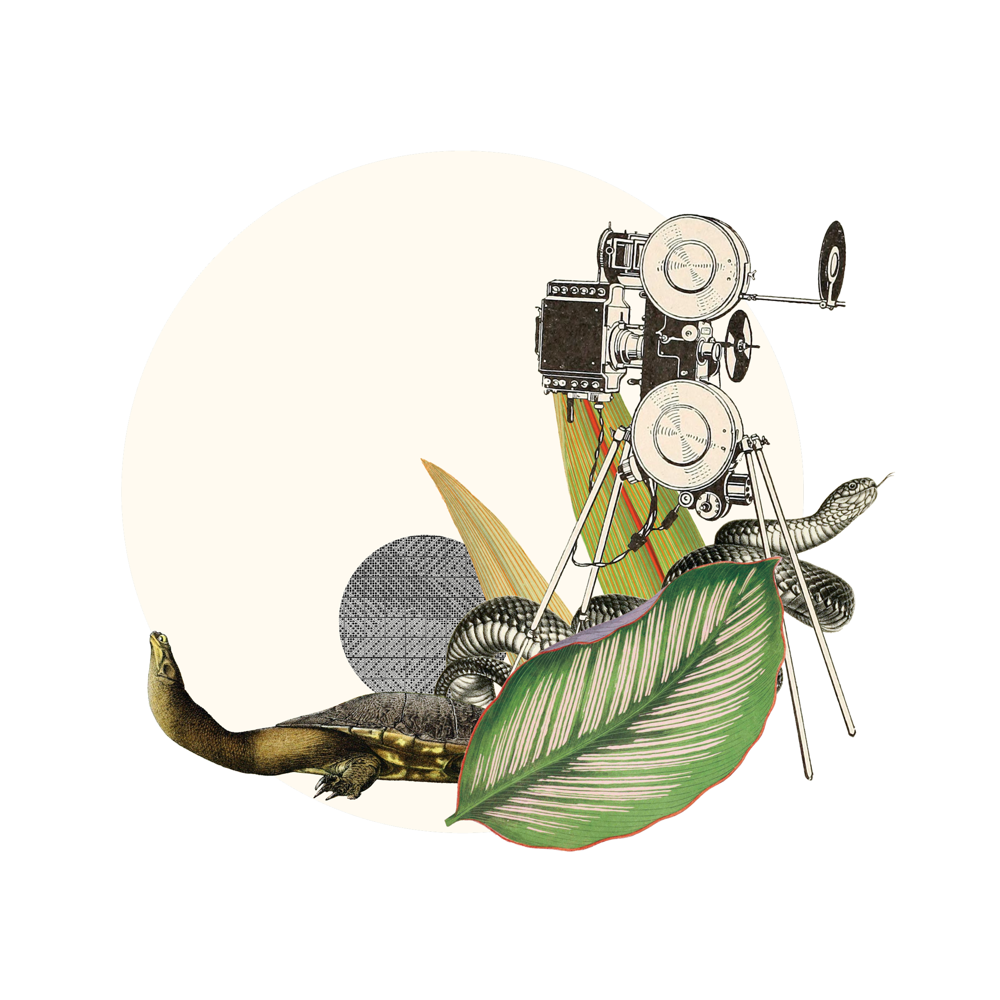

// add cover image to img directory and update filename below
ifdef::backend-html5[]

endif::backend-html5[]

== Colophon

=== Suggested citation

Reyserhove L, Norton B & Desmet P. Best Practices for Managing and Publishing Camera Trap Data. First edition. GBIF Secretariat: Copenhagen. 
// Uncomment once a DOI is assigned
//https://doi.org/10.EXAMPLE/EXAMPLE

=== Authors

https://www.orcid.org/0000-0001-7484-9267[Lien Reyserhove], https://www.orcid.org/0000-0002-5819-9134[Ben Norton], https://www.orcid.org/0000-0002-8442-8025[Peter Desmet]

=== Contributors

Tanja Milotic and Pieter Huybrechts of the Research Institute for Nature and Forest (INBO), Brussels, contributed to this version of the document.

=== Licence

The document _Best Practices for Managing and Publishing Camera Trap Data_ is licensed under https://creativecommons.org/licenses/by-sa/4.0[Creative Commons Attribution-ShareAlike 4.0 Unported License].

=== Persistent URI

#TODO: Assign a DOI before publication#
// Uncomment once a DOI is assigned
//https://doi.org/10.EXAMPLE/EXAMPLE

=== Document control

First edition, September 2023

// include reference to provenance if possible/relevant
// https://doi.org/10.EXAMPLE/2ND-EXAMPLE[Second edition], March 2015, by Due Autore and https://orcid.org/0000-0000-0000-0000[Troisième Auteur].

// Originally based on an earlier publication, _Towards establishing the special guide to something_.
