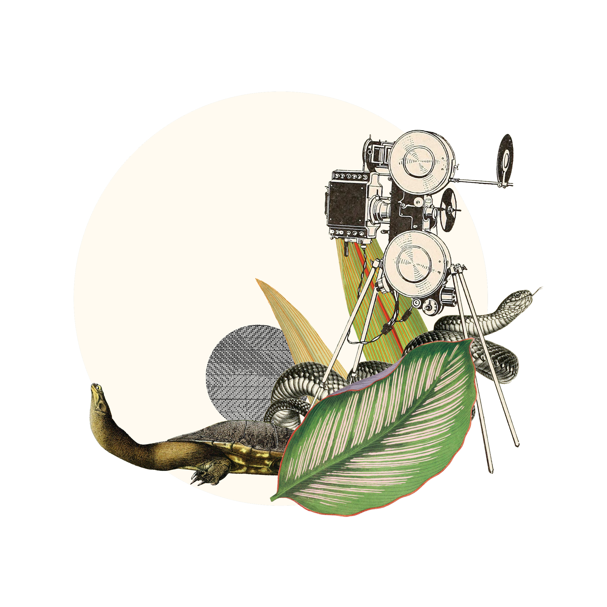

= Best Practices for Managing and Publishing Camera Trap Data
:authorcount: 3
:author_1: Lien Reyserhove
:author_2: Ben Norton
:author_3: Peter Desmet
:toc: left
:toclevels: 3
:numbered:
:revnumber: 1.0
:revdate: {git-metadata-date} {git-metadata-time} {git-metadata-timezone}
:title-page-background-image: 
:license: https://creativecommons.org/licenses/by-sa/4.0/
:xrefstyle: short
:source-highlighter: pygments
// Citation style
:bibtex-file: references.bib
:bibtex-style: gbif
:bibtex-order: alphabetical
:bibtex-locale: en-GB

// References to GBIF registered extensions
:event-core: link:https://rs.gbif.org/core/dwc_event_2022-02-02.xml[Event core]
:occurrence-core: link:https://rs.gbif.org/core/dwc_occurrence_2022-02-02.xml[Occurrence core]
:occurrence-extension: link:https://rs.gbif.org/core/dwc_occurrence_2022-02-02.xml[Occurrence extension]
:ac-extension: link:https://rs.gbif.org/extension/ac/audubon_2020_10_06.xml[Audubon Media Description extension]
:mof-extension: link:https://rs.gbif.org/extension/dwc/measurements_or_facts_2022-02-02.xml[Measurement Or Facts extension]
:extended-mof-extension: link:https://rs.gbif.org/extension/obis/extended_measurement_or_fact.xml[Extended Measurement Or Facts extension]

// References to Camera DP terms
:package-resources: link:https://camtrap-dp.tdwg.org/metadata/#resources[package.resources,role=term]
:package-profile: link:https://camtrap-dp.tdwg.org/metadata/#profile[package.profile,role=term]
:package-name: link:https://camtrap-dp.tdwg.org/metadata/#name[package.name,role=term]
:package-id: link:https://camtrap-dp.tdwg.org/metadata/#id[package.id,role=term]
:package-created: link:https://camtrap-dp.tdwg.org/metadata/#created[package.created,role=term]
:package-title: link:https://camtrap-dp.tdwg.org/metadata/#title[package.title,role=term]
:package-contributors: link:https://camtrap-dp.tdwg.org/metadata/#contributors[package.contributors,role=term]
:package-contributors-role: link:https://camtrap-dp.tdwg.org/metadata/#contributors.role[package.contributors.role,role=term]
:package-description: link:https://camtrap-dp.tdwg.org/metadata/#description[package.description,role=term]
:package-version: link:https://camtrap-dp.tdwg.org/metadata/#version[package.version,role=term]
:package-keywords: link:https://camtrap-dp.tdwg.org/metadata/#keywords[package.keywords,role=term]
:package-image: link:https://camtrap-dp.tdwg.org/metadata/#image[package.image,role=term]
:package-homepage: link:https://camtrap-dp.tdwg.org/metadata/#homepage[package.homepage,role=term]
:package-sources: link:https://camtrap-dp.tdwg.org/metadata/#sources[package.sources,role=term]
:package-licenses: link:https://camtrap-dp.tdwg.org/metadata/#licenses[package.licenses,role=term]
:package-bibliographicCitation: link:https://camtrap-dp.tdwg.org/metadata/#bibliographicCitation[package.bibliographicCitation,role=term]
:package-project: link:https://camtrap-dp.tdwg.org/metadata/#project[package.project,role=term]
:package-project-id: link:https://camtrap-dp.tdwg.org/metadata/#project.id[package.project.id,role=term]
:package-project-title: link:https://camtrap-dp.tdwg.org/metadata/#project.title[package.project.title,role=term]
:package-project-acronym: link:https://camtrap-dp.tdwg.org/metadata/#project.acronym[package.project.acronym,role=term]
:package-project-description: link:https://camtrap-dp.tdwg.org/metadata/#project.description[package.project.description,role=term]
:package-project-path: link:https://camtrap-dp.tdwg.org/metadata/#project.path[package.project.path,role=term]
:package-project-samplingDesign: link:https://camtrap-dp.tdwg.org/metadata/#project.samplingDesign[package.project.samplingDesign,role=term]
:package-project-captureMethod: link:https://camtrap-dp.tdwg.org/metadata/#project.captureMethod[package.project.captureMethod,role=term]
:package-project-individualAnimals: link:https://camtrap-dp.tdwg.org/metadata/#project.individualAnimals[package.project.individualAnimals,role=term]
:package-project-observationLevel: link:https://camtrap-dp.tdwg.org/metadata/#project.observationLevel[package.project.observationLevel,role=term]
:package-coordinatePrecision: link:https://camtrap-dp.tdwg.org/metadata/#coordinatePrecision[package.coordinatePrecision,role=term]
:package-spatial: link:https://camtrap-dp.tdwg.org/metadata/#spatial[package.spatial,role=term]
:package-temporal: link:https://camtrap-dp.tdwg.org/metadata/#temporal[package.temporal,role=term]
:package-taxonomic: link:https://camtrap-dp.tdwg.org/metadata/#taxonomic[package.taxonomic,role=term]
:package-relatedIdentifiers: link:https://camtrap-dp.tdwg.org/metadata/#relatedIdentifiers[package.relatedIdentifiers,role=term]
:package-references: link:https://camtrap-dp.tdwg.org/metadata/#references[package.references,role=term]
:deployments: link:https://camtrap-dp.tdwg.org/data/#deployments[deployments,role=term]
:deployments-deploymentID: link:https://camtrap-dp.tdwg.org/data/#deployments.deploymentID[deployments.deploymentID,role=term]
:deployments-locationID: link:https://camtrap-dp.tdwg.org/data/#deployments.locationID[deployments.locationID,role=term]
:deployments-locationName: link:https://camtrap-dp.tdwg.org/data/#deployments.locationName[deployments.locationName,role=term]
:deployments-latitude: link:https://camtrap-dp.tdwg.org/data/#deployments.latitude[deployments.latitude,role=term]
:deployments-longitude: link:https://camtrap-dp.tdwg.org/data/#deployments.longitude[deployments.longitude,role=term]
:deployments-coordinateUncertainty: link:https://camtrap-dp.tdwg.org/data/#deployments.coordinateUncertainty[deployments.coordinateUncertainty,role=term]
:deployments-deploymentStart: link:https://camtrap-dp.tdwg.org/data/#deployments.deploymentStart[deployments.deploymentStart,role=term]
:deployments-deploymentEnd: link:https://camtrap-dp.tdwg.org/data/#deployments.deploymentEnd[deployments.deploymentEnd,role=term]
:deployments-setupBy: link:https://camtrap-dp.tdwg.org/data/#deployments.setupBy[deployments.setupBy,role=term]
:deployments-cameraID: link:https://camtrap-dp.tdwg.org/data/#deployments.cameraID[deployments.cameraID,role=term]
:deployments-cameraModel: link:https://camtrap-dp.tdwg.org/data/#deployments.cameraModel[deployments.cameraModel,role=term]
:deployments-cameraDelay: link:https://camtrap-dp.tdwg.org/data/#deployments.cameraDelay[deployments.cameraDelay,role=term]
:deployments-cameraHeight: link:https://camtrap-dp.tdwg.org/data/#deployments.cameraHeight[deployments.cameraHeight,role=term]
:deployments-cameraDepth: link:https://camtrap-dp.tdwg.org/data/#deployments.cameraDepth[deployments.cameraDepth,role=term]
:deployments-cameraTilt: link:https://camtrap-dp.tdwg.org/data/#deployments.cameraTilt[deployments.cameraTilt,role=term]
:deployments-cameraHeading: link:https://camtrap-dp.tdwg.org/data/#deployments.cameraHeading[deployments.cameraHeading,role=term]
:deployments-detectionDistance: link:https://camtrap-dp.tdwg.org/data/#deployments.detectionDistance[deployments.detectionDistance,role=term]
:deployments-timestampIssues: link:https://camtrap-dp.tdwg.org/data/#deployments.timestampIssues[deployments.timestampIssues,role=term]
:deployments-baitUse: link:https://camtrap-dp.tdwg.org/data/#deployments.baitUse[deployments.baitUse,role=term]
:deployments-featureType: link:https://camtrap-dp.tdwg.org/data/#deployments.featureType[deployments.featureType,role=term]
:deployments-habitat: link:https://camtrap-dp.tdwg.org/data/#deployments.habitat[deployments.habitat,role=term]
:deployments-deploymentGroups: link:https://camtrap-dp.tdwg.org/data/#deployments.deploymentGroups[deployments.deploymentGroups,role=term]
:deployments-deploymentTags: link:https://camtrap-dp.tdwg.org/data/#deployments.deploymentTags[deployments.deploymentTags,role=term]
:deployments-deploymentComments: link:https://camtrap-dp.tdwg.org/data/#deployments.deploymentComments[deployments.deploymentComments,role=term]
:media: link:https://camtrap-dp.tdwg.org/data/#media[media,role=term]
:media-mediaID: link:https://camtrap-dp.tdwg.org/data/#media.mediaID[media.mediaID,role=term]
:media-deploymentID: link:https://camtrap-dp.tdwg.org/data/#media.deploymentID[media.deploymentID,role=term]
:media-captureMethod: link:https://camtrap-dp.tdwg.org/data/#media.captureMethod[media.captureMethod,role=term]
:media-timestamp: link:https://camtrap-dp.tdwg.org/data/#media.timestamp[media.timestamp,role=term]
:media-filePath: link:https://camtrap-dp.tdwg.org/data/#media.filePath[media.filePath,role=term]
:media-filePublic: link:https://camtrap-dp.tdwg.org/data/#media.filePublic[media.filePublic,role=term]
:media-fileName: link:https://camtrap-dp.tdwg.org/data/#media.fileName[media.fileName,role=term]
:media-fileMediatype: link:https://camtrap-dp.tdwg.org/data/#media.fileMediatype[media.fileMediatype,role=term]
:media-exifData: link:https://camtrap-dp.tdwg.org/data/#media.exifData[media.exifData,role=term]
:media-favorite: link:https://camtrap-dp.tdwg.org/data/#media.favorite[media.favorite,role=term]
:media-mediaComments: link:https://camtrap-dp.tdwg.org/data/#media.mediaComments[media.mediaComments,role=term]
:observations: link:https://camtrap-dp.tdwg.org/data/#observations[observations,role=term]
:observations-observationID: link:https://camtrap-dp.tdwg.org/data/#observations.observationID[observations.observationID,role=term]
:observations-deploymentID: link:https://camtrap-dp.tdwg.org/data/#observations.deploymentID[observations.deploymentID,role=term]
:observations-mediaID: link:https://camtrap-dp.tdwg.org/data/#observations.mediaID[observations.mediaID,role=term]
:observations-eventID: link:https://camtrap-dp.tdwg.org/data/#observations.eventID[observations.eventID,role=term]
:observations-eventStart: link:https://camtrap-dp.tdwg.org/data/#observations.eventStart[observations.eventStart,role=term]
:observations-eventEnd: link:https://camtrap-dp.tdwg.org/data/#observations.eventEnd[observations.eventEnd,role=term]
:observations-observationLevel: link:https://camtrap-dp.tdwg.org/data/#observations.observationLevel[observations.observationLevel,role=term]
:observations-observationType: link:https://camtrap-dp.tdwg.org/data/#observations.observationType[observations.observationType,role=term]
:observations-cameraSetupType: link:https://camtrap-dp.tdwg.org/data/#observations.cameraSetupType[observations.cameraSetupType,role=term]
:observations-scientificName: link:https://camtrap-dp.tdwg.org/data/#observations.scientificName[observations.scientificName,role=term]
:observations-count: link:https://camtrap-dp.tdwg.org/data/#observations.count[observations.count,role=term]
:observations-lifeStage: link:https://camtrap-dp.tdwg.org/data/#observations.lifeStage[observations.lifeStage,role=term]
:observations-sex: link:https://camtrap-dp.tdwg.org/data/#observations.sex[observations.sex,role=term]
:observations-behavior: link:https://camtrap-dp.tdwg.org/data/#observations.behavior[observations.behavior,role=term]
:observations-individualID: link:https://camtrap-dp.tdwg.org/data/#observations.individualID[observations.individualID,role=term]
:observations-individualPositionRadius: link:https://camtrap-dp.tdwg.org/data/#observations.individualPositionRadius[observations.individualPositionRadius,role=term]
:observations-individualPositionAngle: link:https://camtrap-dp.tdwg.org/data/#observations.individualPositionAngle[observations.individualPositionAngle,role=term]
:observations-individualSpeed: link:https://camtrap-dp.tdwg.org/data/#observations.individualSpeed[observations.individualSpeed,role=term]
:observations-bboxX: link:https://camtrap-dp.tdwg.org/data/#observations.bboxX[observations.bboxX,role=term]
:observations-bboxY: link:https://camtrap-dp.tdwg.org/data/#observations.bboxY[observations.bboxY,role=term]
:observations-bboxWidth: link:https://camtrap-dp.tdwg.org/data/#observations.bboxWidth[observations.bboxWidth,role=term]
:observations-bboxHeight: link:https://camtrap-dp.tdwg.org/data/#observations.bboxHeight[observations.bboxHeight,role=term]
:observations-classificationMethod: link:https://camtrap-dp.tdwg.org/data/#observations.classificationMethod[observations.classificationMethod,role=term]
:observations-classifiedBy: link:https://camtrap-dp.tdwg.org/data/#observations.classifiedBy[observations.classifiedBy,role=term]
:observations-classificationTimestamp: link:https://camtrap-dp.tdwg.org/data/#observations.classificationTimestamp[observations.classificationTimestamp,role=term]
:observations-classificationProbability: link:https://camtrap-dp.tdwg.org/data/#observations.classificationProbability[observations.classificationProbability,role=term]
:observations-observationTags: link:https://camtrap-dp.tdwg.org/data/#observations.observationTags[observations.observationTags,role=term]
:observations-observationComments: link:https://camtrap-dp.tdwg.org/data/#observations.observationComments[observations.observationComments,role=term]

// "This document is also available as PDF/languages"
ifdef::backend-html5[]
languageLinks:combined[]
endif::backend-html5[]

// Sections
:sectnums!:

include::colophon.en.adoc[]

:sectnums:

include::100.en.adoc[]

include::200.en.adoc[]

include::300.en.adoc[]

include::400.en.adoc[]

:sectnums!:

include::afterword.en.adoc[]

include::glossary.en.adoc[]

include::bibliography.en.adoc[]
